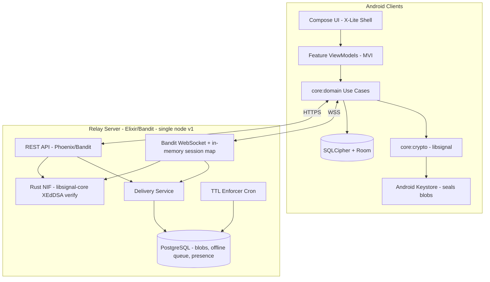
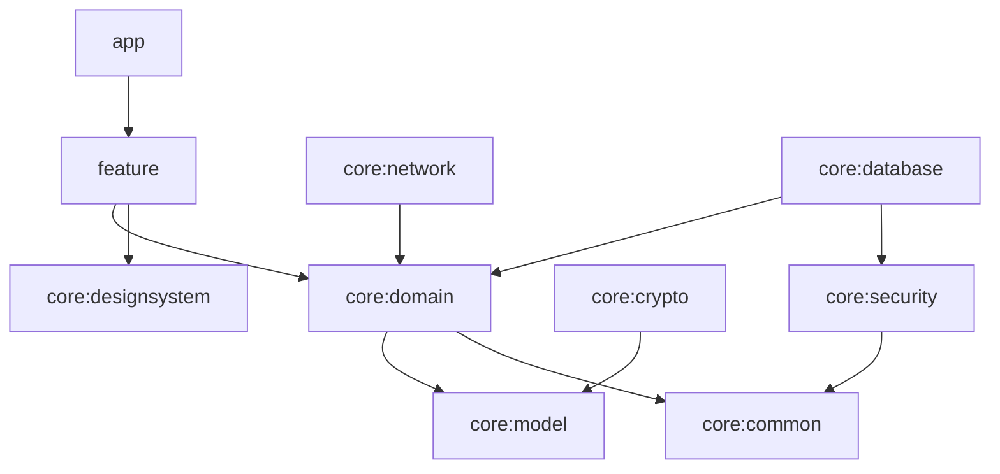
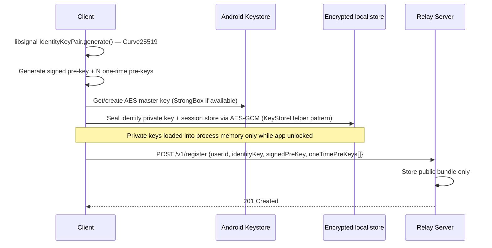
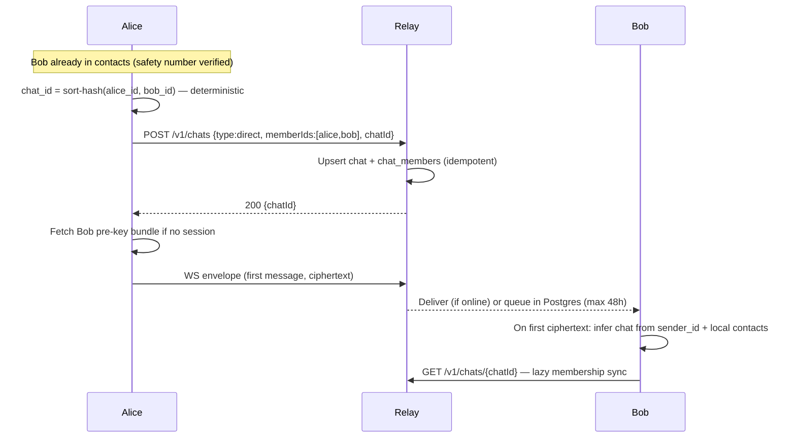
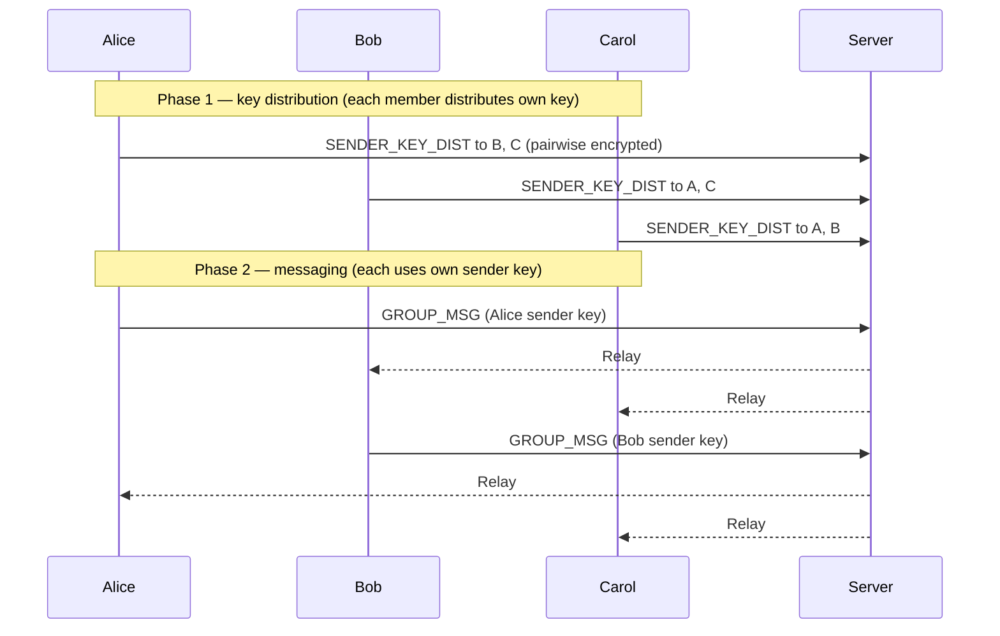
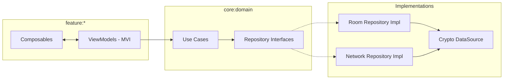
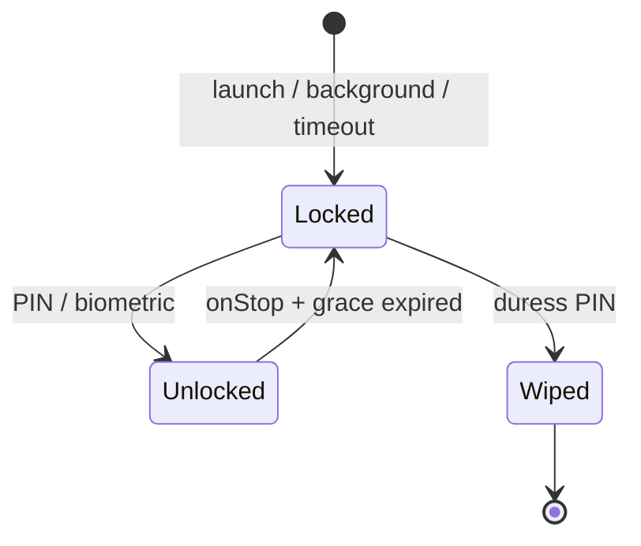

# AWChat — Encrypted Ephemeral Chat: System Design

| Field        | Value                                |
| ------------ | ------------------------------------ |
| **Author**   | TBD                                  |
| **Date**     | 2026-06-07                           |
| **Status**   | Draft (rev 4 — re-review addressed)  |
| **Repo**     | `/home/awfixer/Projects/awchat`      |
| **Audience** | Senior engineers implementing AWChat |

---

## Overview

AWChat is a greenfield transformation of a Kotlin JVM CLI scaffold (`org.example.AppKt`, Guava-only `app` module) into a production Android encrypted ephemeral chat application. The product delivers X (Twitter) **X-Lite**-style messaging UX on **Material 3 Expressive**, with **end-to-end encrypted** 1:1 and small-group (≤5) messaging, **1-day post-seen-all deletion**, and **maximum local data protection** (app lock, duress PIN, encrypted Room DB, Keystore-sealed secrets).

The server is intentionally minimal: a **dumb encrypted relay** that never holds plaintext message content. Clients own cryptographic state, retention policy enforcement, and most metadata interpretation. **All compile verification runs on CI from PR 2 onward**; release signing is added later. Builds use **GitHub Actions on Blacksmith runners** (`blacksmith-8vcpu-ubuntu-2404`); local machines use the Nix shell (`flake.nix`, API 36 SDK) for reference only.

---

## Background & Motivation

### Current State (as of 2026-06-07)

| Artifact                                   | State                                                                              |
| ------------------------------------------ | ---------------------------------------------------------------------------------- |
| `settings.gradle.kts`                      | Single `app` module, root name `awchat`                                            |
| Root `build.gradle.kts`                    | **Missing** (added in PR 1)                                                        |
| `app/build.gradle.kts`                     | Kotlin JVM CLI, Java 26 toolchain, `application` plugin                            |
| `gradle/libs.versions.toml`                | `kotlin-jvm` 2.1.20, Guava only                                                    |
| `gradle/wrapper/gradle-wrapper.properties` | Gradle **8.14.4**                                                                  |
| `flake.nix`                                | Android SDK API 36, Temurin JDK 21, Gradle, `just`                                 |
| `Justfile`                                 | **Missing** (flake shell hook references `just build`; added in PR 1)              |
| `flake.nix` shell hook                     | Says "Android 17 / API 37" but SDK pins **API 36** — messaging drift (fix in PR 1) |
| `package.json`                             | Bun tooling: oxlint, oxfmt; **no `scripts` block**                                 |
| Android                                    | No manifest, no Compose, no modules, no workflows                                  |
| Git                                        | Fresh repo, no commits on **`master`** (not `main`)                                |

### Pain Points / Requirements Driving Design

1. **Privacy**: Server must not decrypt messages; minimize durable metadata.
2. **Ephemerality**: Hard requirement — no storage >24h after **all** participants have seen a message.
3. **Small groups only**: ≤5 participants simplifies group crypto (Sender Keys vs full MLS).
4. **Threat model**: Device seizure, coerced unlock, screenshots, rooted devices, backgrounded app exposure.
5. **Build constraint**: No local release builds; CI must produce signed artifacts reproducibly. **Basic Android compile CI starts at PR 2.**

---

## Goals & Non-Goals

### Goals

| ID  | Goal                                                                       |
| --- | -------------------------------------------------------------------------- |
| G1  | E2EE 1:1 messaging using audited primitives (libsignal)                    |
| G2  | E2EE group messaging for 2–5 participants                                  |
| G3  | Seen-by-all read receipts triggering deletion within 24h (client + server) |
| G4  | X-Lite-inspired chat UI with M3 Expressive (Compose)                       |
| G5  | App lock (PIN/biometric), duress PIN silent wipe                           |
| G6  | Encrypted local persistence (SQLCipher + Room), Keystore/StrongBox sealing |
| G7  | Remote CI/CD on Blacksmith producing debug + signed release APK/AAB        |
| G8  | Clean Architecture multi-module structure, testable crypto/network layers  |

### Non-Goals (v1)

| ID  | Non-Goal                                                                                                         |
| --- | ---------------------------------------------------------------------------------------------------------------- |
| NG1 | Message history backup / multi-device sync                                                                       |
| NG2 | Groups >5, channels, public discovery                                                                            |
| NG3 | Media messages / attachments (text-only v1; see v1.1 appendix)                                                   |
| NG4 | iOS client                                                                                                       |
| NG4b | **Official Windows client** — no production-grade Windows app from the core team; see **Community client ports** below |
| NG5 | Federated servers / P2P transport                                                                                |
| NG6 | Server-side searchable encryption                                                                                |
| NG7 | Custom crypto protocol                                                                                           |
| NG8 | **Reliable background message delivery** — v1 requires foreground app or active WebSocket; no FCM wake-up in MVP |

### v1 MVP Limitation: Foreground Delivery

Because NG8 defers FCM (OQ1 default), v1 chat is **not realtime when the app is killed or swiped away**. Undelivered envelopes queue on the server for up to **48h** (see Retention Policy). UX copy: _"Messages deliver when AWChat is open."_ This directly affects seen-by-all purge latency when readers stay offline — mitigated by server hard TTL and in-app "pending purge" indicators.

### Community client ports (e.g. Windows)

The core team does **not** plan to build or support an official **Windows** production client (NG4b). Experimental **Linux desktop** and **TUI** targets remain exploratory and are not a commitment to parity on every desktop OS.

Volunteers may propose a **platform-specific client** maintained in-tree. Release signing keys may be offered when the volunteer:

1. lands and keeps code in **this codebase** under an agreed path (e.g. `clients/windows/` or similar);
2. becomes **code owner** for that subtree (reviews, merges, CI for that target);
3. triages and fixes **bugs reported against that subtree** for a defined support window.

Signing and store credentials stay out of git; distribution details are agreed case-by-case. This policy does not obligate the project to accept every volunteer proposal.

---

## Key Decisions

| Decision                        | Choice                                                                                                                               | Rationale                                                                                                                                                    |
| ------------------------------- | ------------------------------------------------------------------------------------------------------------------------------------ | ------------------------------------------------------------------------------------------------------------------------------------------------------------ |
| **1:1 crypto**                  | Signal Protocol (X3DH + Double Ratchet) via **`libsignal-android`**                                                                  | Battle-tested; correct Android AAR with bundled JNI                                                                                                          |
| **Group crypto (≤5)**           | Signal **Sender Keys** (not MLS)                                                                                                     | Simpler ops for ≤5 members; libsignal-native; MLS adds complexity without benefit at this scale                                                              |
| **Relay server stack**          | **Elixir** (Bandit/OTP) + **Gleam** (protocol core) + **Rust** (libsignal verify NIF) + **PostgreSQL only** (v1)                   | Lightweight BEAM relay; no Redis in v1 — offline queue in Postgres, online routing via in-memory WS map                                                     |
| **Transport**                   | WebSocket primary, HTTP for registration/prekeys                                                                                     | Low latency when foreground; no push in v1 (NG8)                                                                                                             |
| **Local DB**                    | Room + **SQLCipher 4**                                                                                                               | Full-DB encryption; plaintext message bodies inside SQLCipher (see Local Storage Threat Boundary)                                                            |
| **Key storage**                 | libsignal keys in **encrypted local files** sealed by Keystore-derived AES keys; Keystore/StrongBox for DB passphrase + unlock gates | libsignal requires in-process private key access; cannot use non-exportable EC keys in Keystore as ratchet backend (Signal-Android `KeyStoreHelper` pattern) |
| **Retention authority**         | **Client-computed** seen-by-all → signed `PurgeMessage` → server broadcasts `PURGE_NOTIFY`                                           | Server never decrypts receipts; coordinated deletion across all clients                                                                                      |
| **Server retention safety net** | `DELETE WHERE created_at < now() - 48h OR (purge_after IS NOT NULL AND purge_after < now())` — **no `last_receipt_at`**              | Avoids server-side read metadata; 48h absolute ceiling regardless of client state                                                                            |
| **UI framework**                | Jetpack Compose + `MaterialExpressiveTheme`                                                                                          | Matches M3 Expressive motion/shape/typography requirements                                                                                                   |
| **Architecture**                | Clean Architecture + **`core:domain`** + MVI per feature, Hilt DI                                                                    | Explicit domain layer; repository interfaces in `core:domain`, impls in data modules                                                                         |
| **CI runners**                  | `blacksmith-8vcpu-ubuntu-2404`                                                                                                       | KVM for emulator tests, faster cache                                                                                                                         |
| **Target SDK**                  | API **36** (per `flake.nix`)                                                                                                         | Matches SDK pinning; forward-compatible to API 37                                                                                                            |
| **Default branch**              | **`master`**                                                                                                                         | Matches current repo state                                                                                                                                   |

---

## Proposed Design

### High-Level Architecture



**v1 scale limit (no Redis)**: Single Elixir OTP node (Bandit); in-memory `userId → WebSocket` map. Offline envelopes in PostgreSQL. Suitable for MVP (~1k users). HA / multi-node fan-out deferred to v2 (would require Redis or sticky sessions).

### Module Structure

```
awchat/
├── build-logic/                    # Convention plugins
├── app/                            # Nav graph, Hilt root
├── core/
│   ├── common/                     # Result, dispatchers
│   ├── model/                      # Value types: UserId, ChatId, MessageId
│   ├── proto/                      # protobuf: InnerMessage oneof + generated Kotlin
│   ├── domain/                     # Repository interfaces + use cases
│   ├── crypto/                     # libsignal facade
│   ├── network/                    # Ktor client, WebSocket, DTOs
│   ├── database/                   # Room entities, DAOs, repository impls (impls after core:domain)
│   ├── security/                   # AppLock, Keystore sealing, root detect
│   └── designsystem/               # M3 Expressive + X-Lite components
├── feature/
│   ├── onboarding/
│   ├── chat/
│   ├── contacts/
│   ├── settings/
│   └── lock/
├── server/relay/
├── Justfile                        # PR 1: wraps Gradle tasks for flake shell hook
├── gradle/libs.versions.toml
└── .github/workflows/
```

**Dependency rules**:



- Repository **interfaces** live in `core:domain`.
- Repository **implementations** live in `core:database` / `core:network` / `core:crypto`.
- Feature modules contain ViewModels + Composables only; **use cases live in `core:domain`**.

### Target `libs.versions.toml` (illustrative)

```toml
[versions]
agp = "8.9.2"
kotlin = "2.1.20"
compose-bom = "2025.05.00"
hilt = "2.56.2"
room = "2.7.1"
sqlcipher = "4.6.1"
libsignal = "0.86.7"          # libsignal-android (Android client)
ktor = "3.1.2"
detekt = "1.23.8"
protobuf = "4.29.3"
minSdk = "29"
targetSdk = "36"
compileSdk = "36"

[libraries]
libsignal-android = { module = "org.signal:libsignal-android", version.ref = "libsignal" }
# Server relay uses libsignal-core (Rust crate) via awchat_crypto NIF — not Gradle
detekt-formatting = { module = "io.gitlab.arturbosch.detekt:detekt-formatting", version.ref = "detekt" }

[plugins]
android-application = { id = "com.android.application", version.ref = "agp" }
android-library = { id = "com.android.library", version.ref = "agp" }
kotlin-android = { id = "org.jetbrains.kotlin.android", version.ref = "kotlin" }
kotlin-compose = { id = "org.jetbrains.kotlin.plugin.compose", version.ref = "kotlin" }
hilt = { id = "com.google.dagger.hilt.android", version.ref = "hilt" }
ksp = { id = "com.google.devtools.ksp", version = "2.1.20-2.0.1" }
detekt = { id = "io.gitlab.arturbosch.detekt", version.ref = "detekt" }
protobuf = { id = "com.google.protobuf", version = "0.9.4" }
```

### Legal / License Compliance

| Dependency                  | License    | Implication                                                                                                                                                                                                                  |
| --------------------------- | ---------- | ---------------------------------------------------------------------------------------------------------------------------------------------------------------------------------------------------------------------------- |
| `libsignal-android` (app)   | **AGPLv3** | Linking in a distributed app may require offering corresponding source to users who request it, depending on jurisdiction and whether the app is considered a "modified" work                                                |
| `libsignal-core` (server NIF) | **AGPLv3** | Relay Docker image links `libsignal-core` (Rust) for XEdDSA verification; may trigger corresponding-source obligations for **network users** of the relay service — confirm with counsel (distinct from app distribution analysis) |

**Actions before GA**:

1. **Legal review** of AGPL obligations for Play Store vs sideload distribution (OQ3) **and** server container distribution on Fly.io.
2. Publish a **source-offer** page (e.g., GitHub public repo or tarball URL) in app "About" **and** relay deployment docs if counsel confirms obligation — must cover both `libsignal-android` and `libsignal-core` (server NIF) pins.
3. Track libsignal version pins in `NOTICE` file (app + server modules).
4. If AGPL is unacceptable: evaluate **OpenMLS** (Apache 2.0) or a server-mediated pairwise-only MVP — both are major pivots; default is comply via source offer.

---

### Cryptographic Protocol

#### Identity & Registration

Signal identity keys use **Curve25519** (`IdentityKeyPair` in libsignal), **not** NIST P-256.



- **User ID**: `awchat:` + base32 fingerprint of identity public key.
- **Keystore role**: Wraps AES keys that encrypt libsignal key material on disk and the SQLCipher passphrase — **not** a non-exportable EC ratchet backend.
- **Contact trust**: Safety number (SHA-256 of sorted identity keys) on first message.

#### 1:1 Messaging (Double Ratchet)

```kotlin
// core/crypto/SessionManager.kt
interface SessionManager {
    suspend fun establishSession(peerId: UserId, preKeyBundle: PreKeyBundle): Result<Unit>
    suspend fun encrypt(peerId: UserId, plaintext: ByteArray): EncryptedEnvelope
    suspend fun decrypt(peerId: UserId, envelope: EncryptedEnvelope): Result<ByteArray>
}
```

- Library: `org.signal:libsignal-android` (AAR + JNI), wrappers on `Dispatchers.Default`.
- **Inner plaintext** (before Double Ratchet / sender-key encryption) is a protobuf `InnerMessage` with a type discriminator. The libsignal ciphertext wraps the serialized `InnerMessage` bytes.

```protobuf
// core/proto/inner_message.proto — v1 text-only CHAT body; structured non-chat types
syntax = "proto3";
package awchat.v1;

enum InnerMessageType {
  INNER_MESSAGE_TYPE_UNSPECIFIED = 0;
  CHAT = 1;
  READ_RECEIPT = 2;
  SENDER_KEY_DIST = 3;
  PURGE_ACK = 4;
}

message ChatPayload {
  string body = 1;              // text-only in v1
  int64 client_timestamp = 2;
}

message ReadReceiptPayload {
  string message_id = 1;
  string reader_id = 2;
  int64 seen_at = 3;            // Unix millis; compare with max() for purge deadline
}

message SenderKeyDistPayload {
  string group_id = 1;
  bytes distribution_bytes = 2; // libsignal SenderKeyDistributionMessage serialized
}

message PurgeAckPayload {
  string message_id = 1;
}

message InnerMessage {
  InnerMessageType type = 1;
  oneof payload {
    ChatPayload chat = 2;
    ReadReceiptPayload read_receipt = 3;
    SenderKeyDistPayload sender_key_dist = 4;
    PurgeAckPayload purge_ack = 5;
  }
}
```

- v1 `CHAT` body is text-only; `SENDER_KEY_DIST` / `READ_RECEIPT` carry structured fields (no attachments).

#### Conversation Lifecycle

##### 1:1 (Direct) Chat



| Rule                       | Detail                                                                      |
| -------------------------- | --------------------------------------------------------------------------- |
| **When created**           | On first send attempt to a verified contact (not on contact add alone)      |
| **Consent**                | Receiving first message implies participation; no accept/reject in v1       |
| **`chat_id` (DM)**         | `dm_` + base32(SHA-256(sort([idA, idB]))) — both clients derive identically |
| **Membership**             | Exactly 2 rows in `chat_members`; server rejects duplicates                 |
| **Client learns `chatId`** | Derives locally before first send; confirmed by server on `POST /v1/chats`  |

##### Group Chat

```mermaid
sequenceDiagram
    participant A as Creator
    participant S as Relay
    participant M as Members

    A->>S: POST /v1/chats {type:group, memberIds[2..5], name?}
    S->>S: Validate count <= 5; generate chat_id = grp_ULID
    S-->>A: 201 {chatId, members}
    S-->>M: WS chat_created {chatId, members, creator}
    M->>M: Store chat; begin sender-key exchange (see Group Messaging)
```

| Rule                  | Detail                                                                                         |
| --------------------- | ---------------------------------------------------------------------------------------------- |
| **When created**      | Explicit creator action; min 2 members                                                         |
| **`chat_id` (group)** | `grp_` + ULID (server-assigned)                                                                |
| **Consent**           | Members notified via `chat_created`; no invite accept flow in v1                               |
| **Member sync**       | `GET /v1/chats/{chatId}` + `PATCH /v1/chats/{chatId}/members` + `membership_changed` WS events |

##### Group Membership Changes

| Rule               | Detail                                                                                                 |
| ------------------ | ------------------------------------------------------------------------------------------------------ |
| **Who may change** | Any current group member may add/remove (v1 simplification); server validates caller ∈ `chat_members`  |
| **Add**            | `PATCH` with `{ "add": ["awchat:..."] }`; server rejects if resulting count > 5                        |
| **Remove**         | `PATCH` with `{ "remove": ["awchat:..."] }`; server rejects if resulting count < 2                     |
| **Direct chats**   | Membership changes forbidden (`409`); DMs are immutable pairs                                          |
| **Side effects**   | Server updates `chat_members`, broadcasts `membership_changed`, clients run sender-key rotation matrix |

**`PATCH /v1/chats/{chatId}/members`** (requires **REST Request Authentication** headers)

Request body:

```json
{
  "add": ["awchat:DEF..."],
  "remove": []
}
```

Response `200`:

```json
{
  "chatId": "grp_01H...",
  "members": ["awchat:ABC...", "awchat:DEF...", "awchat:GHI..."],
  "changedAt": "2026-06-07T14:00:00Z"
}
```

Errors: `403` (not a member), `409` (direct chat or count violation), `422` (invalid userId).

#### Group Messaging (Sender Keys, ≤5 members)

**Each member** owns a distinct sender key per group. Before sending, a member must distribute their sender key to every other member via pairwise-encrypted `SENDER_KEY_DIST` messages.



**Per-member sender key table** (local):

| Group | Sender | Key state                   |
| ----- | ------ | --------------------------- |
| G     | Alice  | `received` / `pending_dist` |
| G     | Bob    | `received` / `pending_dist` |
| G     | Carol  | `received` / `pending_dist` |

**Membership change rotation matrix**:

| Event                    | Action                                                                                                                  |
| ------------------------ | ----------------------------------------------------------------------------------------------------------------------- |
| **Member added**         | All existing members (including new) generate **new** sender keys and re-distribute to entire group; old keys discarded |
| **Member removed**       | Remaining members rotate keys; removed member's keys deleted locally                                                    |
| **Distribution failure** | Retry with exponential backoff; block sending until all `pending_dist` resolved for own key                             |
| **Ordering**             | Server relays FIFO per chat; clients buffer out-of-order sender-key dist messages up to 60s                             |

#### Read Receipts & Ephemeral Deletion

**Message types** (inside encrypted protobuf):

| Type              | Purpose                              |
| ----------------- | ------------------------------------ |
| `CHAT`            | User-visible text                    |
| `READ_RECEIPT`    | `{ message_id, reader_id, seen_at }` |
| `SENDER_KEY_DIST` | Group key distribution               |
| `PURGE_ACK`       | Client confirms local deletion       |

**Seen-by-all algorithm**:

```kotlin
fun isSeenByAll(
    message: StoredMessage,
    participants: Set<UserId>,
    receipts: Map<MessageId, Set<UserId>>,
): Boolean {
    val readers = receipts[message.id].orEmpty() + message.senderId
    return participants.all { it in readers }
}

// Use max receipt timestamp (monotonic-safe); prefer client monotonic clock for UI only
fun computePurgeDeadline(receiptTimestamps: List<Instant>): Instant =
    receiptTimestamps.max() + Duration.ofHours(24)
```

**Clock skew**: Purge **deadline display** uses max of peer `seen_at` from decrypted receipts. **Purge initiation** does not trust client wall clock for server audit — server records `purge_received_at = now()` on `POST /v1/purge`. Duplicate purge requests are **idempotent** (see below).

```mermaid
sequenceDiagram
    participant R as Reader
    participant S as Relay
    participant O as Other Client
    participant P as Peer Client

    R->>S: Encrypted READ_RECEIPT
    S-->>O: Relay receipt
    O->>O: Update receipt aggregate
    alt All participants have read
        O->>S: POST /v1/purge + X-AWChat-* auth headers
        S->>S: Idempotent delete; record purge_received_at
        S-->>O: PURGE_CONFIRM
        S-->>P: WS PURGE_NOTIFY {messageId, chatId, purgedAt}
        S-->>R: WS PURGE_NOTIFY
        O->>O: Delete local rows
        P->>P: Delete local rows on NOTIFY (even if not yet seen-by-all locally)
    end
```

**`PURGE_NOTIFY` WebSocket frame**:

```json
{
  "type": "purge_notify",
  "messageId": "msg_ulid",
  "chatId": "dm_...",
  "purgedAt": "2026-06-07T18:00:00Z"
}
```

**Client behavior on `PURGE_NOTIFY`**: Immediately delete local message + receipts for `messageId`; no user prompt. If already deleted, no-op.

**`POST /v1/purge` idempotency** (`purge_audit` is source of truth):

- Body: `{ messageId, chatId, purgedAtClient }`
- Auth: **REST Request Authentication** headers (same scheme as all mutating REST); `requested_by` = `X-AWChat-User-Id`.
- Algorithm:
  1. Verify REST auth signature; validate caller ∈ `chat_members`.
  2. `INSERT INTO purge_audit (message_id, chat_id, requested_by) VALUES (...) ON CONFLICT (message_id) DO NOTHING RETURNING message_id`.
  3. If no row returned → already purged → **`200 OK`** (idempotent).
  4. Else `DELETE FROM message_envelopes WHERE id = :messageId` (hard delete; `envelope_recipients` removed via `ON DELETE CASCADE`).
  5. Broadcast `PURGE_NOTIFY` to all `chat_members`.
- **No `last_receipt_at` column** — avoids server-side read metadata.

#### Retention Policy (Authoritative)

| Layer                             | Rule                                                              | Trigger                               |
| --------------------------------- | ----------------------------------------------------------------- | ------------------------------------- |
| **Client purge deadline**         | Delete locally within **24h after seen-by-all**                   | Encrypted receipts aggregated locally |
| **Client-initiated server purge** | Any participant may call `POST /v1/purge` once seen-by-all        | Signed request                        |
| **Server `purge_after`**          | Client sets on send: default `sent_at + 48h` (upper bound)        | Outbound envelope metadata            |
| **Server hard TTL**               | Delete if `created_at < now() - 48h` **OR** `purge_after < now()` | Cron every 15 min                     |
| **Offline undelivered queue**     | Same **48h** ceiling as hard TTL — not 7 days                     | `created_at` on envelope              |

```sql
-- Authoritative server TTL cron (every 15 min)
-- Rows already purged are hard-deleted; purge_audit retains audit trail
DELETE FROM message_envelopes
WHERE created_at < NOW() - INTERVAL '48 hours'
   OR purge_after < NOW();
```

**No `last_receipt_at`** anywhere in server schema — receipt timing stays inside E2EE payloads.

#### Message Delivery ACK / Retry

**Semantics**: At-least-once delivery; client deduplicates by `id` (ULID).

| WS frame `type` | Direction       | Purpose                                                      |
| --------------- | --------------- | ------------------------------------------------------------ |
| `envelope`      | Server → Client | Deliver ciphertext                                           |
| `ack`           | Client → Server | `{ envelopeId, receivedAt }` — processed + persisted locally |
| `nack`          | Client → Server | `{ envelopeId, reason }` — server schedules redelivery       |
| `envelope`      | Client → Server | Outbound send                                                |

**Server rules**:

- On `ack`: set `envelope_recipients.delivered_at`; if all recipients acked, envelope eligible for early purge (still subject to seen-by-all).
- On missing `ack` within 30s: redeliver on next WS connect (up to 48h `created_at` limit).
- Client sends `ack` only after Room transaction commits decrypted/envelope row.
- Idempotency: duplicate `envelope.id` → client drops second copy, still sends `ack`.

#### WebSocket Frame Catalog (v1)

All frames are JSON objects with a `type` field. See **PR 5** (server) and **PR 11** (client) for implementation.

**Server → Client: `auth_challenge`** (first frame after connect)

```json
{
  "type": "auth_challenge",
  "nonce": "base64...",
  "serverTime": "2026-06-07T12:00:00Z",
  "ttlSec": 120
}
```

**Client → Server: `auth_response`**

```json
{
  "type": "auth_response",
  "userId": "awchat:ABC...",
  "nonce": "base64...",
  "serverTime": "2026-06-07T12:00:00Z",
  "signature": "base64..."
}
```

**Server → Client: `auth_ok`**

```json
{
  "type": "auth_ok",
  "connectionId": "conn_ulid"
}
```

**Server → Client: `auth_failed`**

```json
{
  "type": "auth_failed",
  "code": "nonce_expired",
  "message": "Challenge expired; reconnect"
}
```

**Bidirectional: `envelope`** (ciphertext relay)

```json
{
  "type": "envelope",
  "id": "01HMSG...",
  "chatId": "dm_...",
  "senderId": "awchat:ABC...",
  "ciphertext": "base64...",
  "sentAt": "2026-06-07T12:00:00Z"
}
```

**Client → Server: `ack`**

```json
{
  "type": "ack",
  "envelopeId": "01HMSG...",
  "receivedAt": "2026-06-07T12:00:01Z"
}
```

**Client → Server: `nack`**

```json
{
  "type": "nack",
  "envelopeId": "01HMSG...",
  "reason": "decrypt_failed"
}
```

**Server → Client: `chat_created`**

```json
{
  "type": "chat_created",
  "chatId": "grp_01H...",
  "chatType": "group",
  "members": ["awchat:ABC...", "awchat:DEF..."],
  "creatorId": "awchat:ABC...",
  "createdAt": "2026-06-07T12:00:00Z"
}
```

**Server → Client: `membership_changed`**

```json
{
  "type": "membership_changed",
  "chatId": "grp_01H...",
  "added": ["awchat:GHI..."],
  "removed": [],
  "members": ["awchat:ABC...", "awchat:DEF...", "awchat:GHI..."],
  "changedBy": "awchat:ABC...",
  "changedAt": "2026-06-07T14:00:00Z"
}
```

**Server → Client: `purge_notify`**

```json
{
  "type": "purge_notify",
  "messageId": "01HMSG...",
  "chatId": "dm_...",
  "purgedAt": "2026-06-07T18:00:00Z"
}
```

**Server → Client: `error`** (non-fatal)

```json
{
  "type": "error",
  "code": "rate_limited",
  "message": "Too many envelopes per minute"
}
```

### Relay Server Design

#### Responsibilities

| Responsibility             | Server Knowledge                                        |
| -------------------------- | ------------------------------------------------------- |
| Store ciphertext envelopes | Ciphertext + routing metadata only                      |
| Fan-out to online clients  | In-memory WS map; Postgres queue if offline             |
| Offline queue              | **Max 48h** (same as hard TTL)                          |
| Pre-key bundle hosting     | Public keys only                                        |
| Enforce group size ≤5      | Member IDs                                              |
| TTL deletion               | Timestamps, envelope IDs                                |
| Presence                   | `users.last_seen_at` updated on WS heartbeat (optional) |

#### Data Model (PostgreSQL)

```sql
CREATE TABLE users (
    id            TEXT PRIMARY KEY,
    identity_key  BYTEA NOT NULL,
    created_at    TIMESTAMPTZ NOT NULL DEFAULT NOW(),
    last_seen_at  TIMESTAMPTZ
);

CREATE TABLE prekeys (
    user_id       TEXT REFERENCES users(id),
    key_id        INT,
    public_key    BYTEA NOT NULL,
    consumed      BOOLEAN DEFAULT FALSE,
    PRIMARY KEY (user_id, key_id)
);

CREATE TABLE chats (
    id            TEXT PRIMARY KEY,
    type          TEXT CHECK (type IN ('direct', 'group')),
    created_at    TIMESTAMPTZ NOT NULL DEFAULT NOW()
);

CREATE TABLE chat_members (
    chat_id       TEXT REFERENCES chats(id),
    user_id       TEXT REFERENCES users(id),
    PRIMARY KEY (chat_id, user_id)
);

CREATE TABLE message_envelopes (
    id            TEXT PRIMARY KEY,
    chat_id       TEXT REFERENCES chats(id),
    sender_id     TEXT REFERENCES users(id),
    ciphertext    BYTEA NOT NULL,
    created_at    TIMESTAMPTZ NOT NULL DEFAULT NOW(),
    purge_after   TIMESTAMPTZ NOT NULL    -- default created_at + 48h; hard-deleted on purge
);

CREATE TABLE auth_nonces (
    nonce         BYTEA PRIMARY KEY,
    created_at    TIMESTAMPTZ NOT NULL DEFAULT NOW(),
    expires_at    TIMESTAMPTZ NOT NULL    -- created_at + 2 min
);

CREATE TABLE envelope_recipients (
    envelope_id   TEXT REFERENCES message_envelopes(id) ON DELETE CASCADE,
    recipient_id  TEXT REFERENCES users(id),
    delivered_at  TIMESTAMPTZ,
    PRIMARY KEY (envelope_id, recipient_id)
);

CREATE TABLE purge_audit (
    message_id    TEXT PRIMARY KEY,
    chat_id       TEXT NOT NULL,
    requested_by  TEXT NOT NULL,
    purge_received_at TIMESTAMPTZ NOT NULL DEFAULT NOW()
);
```

**Storage estimate** (1,000 users, 50 msgs/day, 2 KB ciphertext, 48h retention): ~**200 MB** ciphertext + overhead → plan **500 MB–1 GB**.

#### API Surface

| Method  | Path                         | Auth         | Description                                                        |
| ------- | ---------------------------- | ------------ | ------------------------------------------------------------------ |
| `POST`  | `/v1/register`               | None         | Upload identity + pre-keys                                         |
| `GET`   | `/v1/prekeys/{userId}`       | None         | Fetch pre-key bundle                                               |
| `POST`  | `/v1/chats`                  | **REST sig** | Create/upsert chat (member list ≤5); caller must be in `memberIds` |
| `GET`   | `/v1/chats/{chatId}`         | None         | Membership sync                                                    |
| `PATCH` | `/v1/chats/{chatId}/members` | **REST sig** | Add/remove group members (≤5); caller must be current member       |
| `WS`    | `/v1/ws`                     | WS handshake | Bidirectional frames (see below)                                   |
| `POST`  | `/v1/purge`                  | **REST sig** | Idempotent message deletion                                        |
| `GET`   | `/v1/health`                 | None         | Liveness                                                           |
| `GET`   | `/v1/ready`                  | None         | Readiness (DB reachable)                                           |

#### REST Request Authentication

All **mutating REST** endpoints except `POST /v1/register` require request signing. Uses the same XEdDSA identity key and Rust `awchat_crypto` NIF (`libsignal-core`) verification path as WS auth and purge.

**Required headers**:

| Header               | Value                                       |
| -------------------- | ------------------------------------------- |
| `X-AWChat-User-Id`   | `awchat:...` identity fingerprint           |
| `X-AWChat-Timestamp` | ISO-8601 UTC (e.g., `2026-06-07T12:00:00Z`) |
| `X-AWChat-Signature` | Base64 XEdDSA signature                     |

**Signed input** (UTF-8 string, pipe-delimited):

```
signInput = method + "|" + path + "|" + base64(SHA-256(bodyBytes)) + "|" + timestamp + "|" + userId
```

| Field           | Rule                                                                                    |
| --------------- | --------------------------------------------------------------------------------------- |
| `method`        | Uppercase HTTP verb (`POST`, `PATCH`)                                                   |
| `path`          | Request path only (e.g., `/v1/chats/dm_abc/members`); no host or query string           |
| `bodyBytes`     | Raw request body; empty body → SHA-256 of zero-length input                             |
| `timestamp`     | Same string as `X-AWChat-Timestamp` header                                              |
| `userId`        | Same string as `X-AWChat-User-Id` header                                                |
| Signature       | XEdDSA via libsignal `PrivateKey.sign(signInputUTF8)`; server uses `PublicKey.verify()` |
| Replay window   | Reject if `abs(serverNow - timestamp) > 120s`                                           |
| Identity lookup | Server loads `users.identity_key` for `X-AWChat-User-Id` and verifies                   |

**Per-endpoint authorization** (after signature valid):

| Endpoint                           | Rule                                                                 |
| ---------------------------------- | -------------------------------------------------------------------- |
| `POST /v1/chats`                   | `X-AWChat-User-Id` must appear in request `memberIds`                |
| `PATCH /v1/chats/{chatId}/members` | Caller must be row in `chat_members`; reject on direct chats (`409`) |
| `POST /v1/purge`                   | Caller must be row in `chat_members` for `chatId`                    |

**Example — `PATCH /v1/chats/grp_01H.../members`**:

```http
PATCH /v1/chats/grp_01H.../members HTTP/1.1
X-AWChat-User-Id: awchat:ABC...
X-AWChat-Timestamp: 2026-06-07T14:00:00Z
X-AWChat-Signature: base64...
Content-Type: application/json

{"add":["awchat:GHI..."],"remove":[]}
```

```kotlin
// core/network/RestAuthSigner.kt
fun signRequest(
    identityPrivateKey: PrivateKey,
    method: String,
    path: String,
    body: ByteArray,
    userId: UserId,
    timestamp: String,
): String {
    val bodyHash = Base64.encodeToString(SHA256.digest(body), Base64.NO_WRAP)
    val signInput = "$method|$path|$bodyHash|$timestamp|$userId"
    return Base64.encodeToString(identityPrivateKey.sign(signInput.toByteArray()), Base64.NO_WRAP)
}
```

#### WebSocket Authentication Handshake

```mermaid
sequenceDiagram
    participant C as Client
    participant S as Relay

    C->>S: WS connect TLS
    S-->>C: {type:auth_challenge, nonce, serverTime, ttlSec:120}
    C->>C: signInput = nonceRaw(32B) + "|" + userId + "|" + serverTime (UTF-8)
    C->>C: sig = XEdDSA_sign(identityKey, signInput)
    C->>S: {type:auth_response, userId, nonce:base64(nonceRaw), serverTime, signature}
    S->>S: Verify nonce unused, |now - serverTime| < 120s, XEdDSA valid (Rust NIF)
    S-->>C: {type:auth_ok, connectionId}
    Note over C,S: On reconnect: new nonce; auth required before any frame
```

| Field             | Rule                                                                                                                                                       |
| ----------------- | ---------------------------------------------------------------------------------------------------------------------------------------------------------- |
| `nonce` (wire)    | Base64 encoding of 32 random raw bytes in JSON                                                                                                             |
| `nonce` (storage) | 32 raw bytes in `auth_nonces.nonce` (BYTEA); single-use; `expires_at = now() + 2 min`                                                                      |
| **Signed input**  | `signInputBytes = nonceRaw[32 bytes] ‖ utf8("\|") ‖ utf8(userId) ‖ utf8("\|") ‖ utf8(serverTime)` — decoded raw nonce, **not** the base64 JSON wire string |
| Signature         | **XEdDSA** via libsignal `PrivateKey.sign(signInputBytes)`                                                                                                 |
| Server verify     | Decode JSON `nonce` to 32 bytes, reconstruct `signInputBytes`, verify with `awchat_crypto` NIF (`verify_ws_signature/5`; REST uses `verify_rest_signature/7`) |
| Replay            | Reject duplicate `nonce` bytes; reject if `abs(serverNow - serverTime) > 120s`                                                                             |
| Nonce cleanup     | Delete expired rows on verify path + cron every 5 min: `DELETE FROM auth_nonces WHERE expires_at < NOW()`                                                  |
| Errors            | `auth_failed` → close WS 4001; `nonce_expired` → close 4002                                                                                                |
| REST linkage      | Same `userId` / identity key as REST Request Authentication; no separate password                                                                          |

#### Relay Operability (v1)

| Topic                 | v1 MVP                                                                           |
| --------------------- | -------------------------------------------------------------------------------- |
| **Deployment**        | Single Railway project: relay container + Railway Postgres (OQ4 default)       |
| **Secrets**           | Fly secrets: `DATABASE_URL`, `TLS_CERT`; no keystore on server                   |
| **Migrations**        | Flyway on container start (blocking readiness until complete)                    |
| **Health**            | `/v1/health` liveness; `/v1/ready` checks DB + migration version                 |
| **Graceful shutdown** | SIGTERM → stop accepting WS; drain 10s; close connections; finish in-flight acks |
| **Scaling**           | Single-node only v1; multi-node needs sticky sessions + shared pub/sub (v2)      |
| **Observability**     | Prometheus sidecar; JSON logs to stdout                                          |

### Android Client Architecture



### Local Encrypted Database (Room + SQLCipher)

#### Local Storage Threat Boundary

**v1 model**: Message bodies are stored as **plaintext UTF-8 inside SQLCipher-encrypted Room tables**. SQLCipher encrypts the full database file at rest. The DB passphrase is sealed by Android Keystore and gated by PIN/biometric unlock.

| Threat                              | Defense                                                 |
| ----------------------------------- | ------------------------------------------------------- |
| File exfiltration (device locked)   | SQLCipher + Keystore-sealed passphrase                  |
| File exfiltration (device unlocked) | App lock timeout; duress wipe                           |
| Memory dump while unlocked          | Out of scope for v1; minimize plaintext lifetime in RAM |

**Not used in v1**: Additional per-message AEAD inside SQLCipher (unnecessary if DB key is adequately gated). **v1.1 attachments** will use per-file AES-GCM keys wrapped in `MessagePayload`.

```kotlin
@Module
@InstallIn(SingletonComponent::class)
object DatabaseModule {
    @Provides @Singleton
    fun providePassphrase(keystore: KeystorePassphraseProvider): ByteArray =
        keystore.getOrCreateDatabasePassphrase()

    @Provides @Singleton
    fun provideDb(@ApplicationContext ctx: Context, passphrase: ByteArray): AwChatDatabase =
        Room.databaseBuilder(ctx, AwChatDatabase::class.java, "awchat.db")
            .openHelperFactory(SupportFactory(passphrase))
            .fallbackToDestructiveMigration(false)
            .build()
}
```

**Entities** (v1 text-only):

| Table           | Contents                                            | Retention            |
| --------------- | --------------------------------------------------- | -------------------- |
| `messages`      | Plaintext body + metadata inside SQLCipher          | Deleted on purge     |
| `read_receipts` | Per-message per-reader timestamps                   | Deleted with message |
| `sessions`      | libsignal session blobs (sealed on disk separately) | Until reset          |
| `sender_keys`   | Group sender key material                           | Until rotation       |
| `contacts`      | UserId, safety number, display name                 | Until duress wipe    |

**Duress wipe**: `crypto.wipeKeys()` → `db.clearAllTables()` → overwrite sealed key files → show empty inbox. No attachment dir in v1.

### Security & App Lock



| Control          | Implementation                                                                       |
| ---------------- | ------------------------------------------------------------------------------------ |
| PIN lock         | 6-digit; gates Keystore unlock of SQLCipher passphrase                               |
| Biometric        | `BiometricPrompt` + `CryptoObject`                                                   |
| Duress PIN       | Silent wipe; benign empty state                                                      |
| Keystore         | AES master key for sealing libsignal blobs + DB passphrase; StrongBox when available |
| Screenshot block | `FLAG_SECURE` per-screen toggle                                                      |
| Recents blur     | `setRecentsScreenshotEnabled(false)` (API 33+)                                       |
| Root detection   | Warn or block per settings                                                           |
| Telemetry        | Opt-in crash counts only; no message metadata                                        |

#### Certificate Pinning (Operational)

| Topic          | Policy                                                                                       |
| -------------- | -------------------------------------------------------------------------------------------- |
| **Pin type**   | SPKI SHA-256 of relay leaf or intermediate                                                   |
| **Storage**    | `res/raw/relay_pins.json` only (bundled pins; **no remote config in v1**)                    |
| **Backup pin** | Always ship **two** pins (current + next)                                                    |
| **Rotation**   | New pin in app update N; old pin removed in N+1                                              |
| **Failure UX** | Block with "Can't reach AWChat servers securely" + support link; no silent bypass in release |
| **Debug / CI** | `debug` flavor disables pinning via `BuildConfig.PINNING_ENABLED = false`                    |
| **Emergency**  | Requires app update (no remote kill-switch without update — intentional)                     |

### UI/UX — X-Lite Chat Aesthetic (Material 3 Expressive)

- Single-activity; conversation list home; avatar top-left opens `AccountDrawerSheet`.
- M3 Expressive motion, emphasized typography, shape morph on drawer.
- Components: `ConversationListScreen`, `ConversationRow`, `ChatScreen`, `MessageBubble`, `ComposerBar`, `LockScreen`.

### Observability

| Layer  | Signal                                                                                  |
| ------ | --------------------------------------------------------------------------------------- |
| Client | `kotlin-logging`, tag `AWChat`; no plaintext/ciphertext                                 |
| Relay  | Prometheus: `envelopes_stored`, `purge_lag_seconds`, `ws_connections`, `ack_latency_ms` |
| Alerts | Envelope count growth; purge cron failures; WS error rate >5%                           |

### Rollout Plan

| Phase  | Scope                                              |
| ------ | -------------------------------------------------- |
| **α**  | Internal dogfood, debug CI artifacts               |
| **β**  | Play **Internal Testing** track, signed release CI |
| **GA** | Play Production                                    |

- **Feature flags** (`DataStore`): `enable_root_block`, `enable_screenshot_block`.
- **Rollback**: Forward-only Room migrations; ship N-1 app binary compatible with current relay `/v1`; relay contract frozen per major version; **no reversible SQLCipher migrations** — downgrade = reinstall (data loss acceptable for ephemeral app).

### Risks & Mitigations

| Risk                              | Severity | Mitigation                                     |
| --------------------------------- | -------- | ---------------------------------------------- |
| libsignal JNI on API 36           | High     | PR 3 packaging spike; CI emulator from PR 12   |
| Seen-by-all race (offline member) | High     | 48h hard TTL; `PURGE_NOTIFY`; pending purge UI |
| AGPL compliance                   | High     | Legal review + source offer before GA          |
| Clock skew / duplicate purge      | Medium   | Idempotent purge; max receipt timestamps       |
| Duress forensic recovery          | Medium   | SQLCipher wipe + sealed file overwrite         |
| Single-node relay limits          | Medium   | Document v1 scale; plan v2 HA                  |
| No background delivery (NG8)      | Medium   | Explicit UX; FCM in v1.1 if OQ1 changes        |

---

## API / Interface Changes

### Before

- JVM `main()` prints `"Hello World!"`.

### After

- Android app (internal modules only).
- Relay REST + WebSocket v1 as specified.
- Root `build.gradle.kts` + convention plugins.

---

## Data Model Changes

### Client (Room / SQLCipher)

Schema v1 — text only. v1.1 appendix adds `AttachmentRef` to `ChatPayload` + `attachments` table.

### Server (PostgreSQL)

As above; Flyway in `server/relay`.

---

## v1.1 Appendix (Out of Scope)

- `InnerMessage` extension: `AttachmentRef` in `ChatPayload`
- Per-file AES-256-GCM storage directory (wiped on duress)
- FCM data-only wake-up for background delivery

---

## Alternatives Considered

### 1. MLS (RFC 9420) for Group Encryption

| Pros                                             | Cons                                                   |
| ------------------------------------------------ | ------------------------------------------------------ |
| Modern IETF standard; forward secrecy for groups | Heavier library (`openmls`/native); more complex state |
| Better for larger groups                         | Overkill for ≤5 members                                |

**Rejected for v1**: Operational complexity exceeds benefit at max 5 participants.

### 2. Matrix Protocol (Olm/Megolm)

| Pros                                | Cons                                          |
| ----------------------------------- | --------------------------------------------- |
| Federated; mature Megolm for groups | Server sees room metadata; heavier sync model |
| Element clients exist               | Doesn't fit "minimal relay" goal              |

**Rejected**: Federation and room state complexity conflict with minimal server design.

### 3. Custom Double Ratchet per Group Member (pairwise)

| Pros                 | Cons                                                  |
| -------------------- | ----------------------------------------------------- |
| No sender keys       | O(N) encryption per message; bandwidth ×5 at max size |
| Simpler conceptually | Poor performance vs sender keys                       |

**Rejected**: Sender keys strictly better for group broadcast.

### 4. Server-Side Read Receipt Aggregation (plaintext)

| Pros                      | Cons                                 |
| ------------------------- | ------------------------------------ |
| Easier purge coordination | Server learns who read what and when |

**Rejected**: Metadata leakage; clients chosen as authority with signed purge.

### 5. Redis for Ephemeral Queues (v1)

| Pros                           | Cons                                            |
| ------------------------------ | ----------------------------------------------- |
| Fast fan-out; natural TTL keys | Extra infra; failure modes unspecified in rev 1 |
| Enables multi-node HA          | Unnecessary at MVP scale                        |

**Rejected for v1**: PostgreSQL offline queue + in-memory WS map sufficient for ≤1k users.

---

## Security & Privacy Considerations

### Threat Model

| Adversary       | Capability          | Defense                     |
| --------------- | ------------------- | --------------------------- |
| Network MITM    | TLS intercept       | SPKI pinning + E2EE         |
| Malicious relay | Drop/delay messages | Client `ack`/`nack` + retry |
| Device thief    | Physical access     | App lock + SQLCipher        |
| Coerced unlock  | Forced PIN          | Duress wipe                 |
| Rooted device   | Memory hooks        | Optional block              |

### Auth

- Identity = Curve25519 key pair; signatures use **XEdDSA** (libsignal), not standalone Ed25519.
- **Mutating REST** (`POST /v1/chats`, `PATCH .../members`, `POST /v1/purge`): `X-AWChat-*` header signing per **REST Request Authentication**.
- **WebSocket**: separate handshake signing per **WebSocket Authentication Handshake** (raw nonce bytes in sign input).
- Server (`server:relay`) uses the `awchat_crypto` Rust NIF (`libsignal-core`) for XEdDSA verification on all signed REST and WS requests.
- PIN gates local Keystore/SQLCipher unlock only.

---

## CI/CD — GitHub Actions + Blacksmith

### Constraints

- Release builds remote-only; **debug compile CI from PR 2**.
- Default branch: **`master`** (workflow triggers use `refs/heads/master`).
- `package.json` scripts added in PR 1.

### PR → CI Mapping

| PR    | CI milestone                                                 |
| ----- | ------------------------------------------------------------ |
| PR 2  | Minimal `android.yml`: `assembleDebug` + `testDebugUnitTest` |
| PR 12 | Expanded: oxlint, detekt, emulator instrumented tests        |
| PR 23 | Release: `assemble-release` + signed AAB/APK on `master`     |

### Workflow Layout (phased)

**PR 2 — minimal `android.yml`**:

```yaml
name: Android CI
on: [push, pull_request]

jobs:
  compile-debug:
    runs-on: blacksmith-8vcpu-ubuntu-2404
    steps:
      - uses: actions/checkout@v4
      - uses: actions/setup-java@v4
        with: { distribution: temurin, java-version: 21 }
      - run: ./gradlew assembleDebug testDebugUnitTest --no-daemon
```

**PR 12 — expanded** (adds detekt, oxlint, emulator):

```yaml
static-analysis:
  runs-on: blacksmith-8vcpu-ubuntu-2404
  steps:
    - uses: actions/checkout@v4
    - uses: actions/setup-java@v4
      with: { distribution: temurin, java-version: 21 }
    - uses: oven-sh/setup-bun@v2
    - run: bun install && bun run lint # scripts added PR 1
    - run: ./gradlew detekt

instrumented-test:
  runs-on: blacksmith-8vcpu-ubuntu-2404
  steps:
    - uses: reactivecircus/android-emulator-runner@v2
      with:
        api-level: 36
        arch: x86_64
        script: ./gradlew connectedDebugAndroidTest
```

**PR 23 — release** (master only):

```yaml
assemble-release:
  runs-on: blacksmith-8vcpu-ubuntu-2404
  if: github.ref == 'refs/heads/master'
  steps:
    - run: ./scripts/ci-decode-keystore.sh
    - run: ./gradlew bundleRelease assembleRelease
    - uses: actions/upload-artifact@v4
```

### PR 1 `package.json` scripts (to be added)

```json
{
  "scripts": {
    "lint": "oxlint .",
    "fmt": "oxfmt --check .",
    "fmt:fix": "oxfmt ."
  }
}
```

### Signing Strategy

| Secret                     | Purpose           |
| -------------------------- | ----------------- |
| `AWCHAT_KEYSTORE_BASE64`   | Release keystore  |
| `AWCHAT_KEYSTORE_PASSWORD` | Keystore password |
| `AWCHAT_KEY_ALIAS`         | Key alias         |
| `AWCHAT_KEY_PASSWORD`      | Key password      |

---

## Open Questions

| #   | Question                                 | Owner           | Default                                      |
| --- | ---------------------------------------- | --------------- | -------------------------------------------- |
| OQ1 | FCM for background delivery?             | Product         | **Defer** — NG8 documents limitation         |
| OQ2 | Contact discovery (QR only vs username)? | Product         | QR + manual safety number                    |
| OQ3 | Play Store vs sideload?                  | Product / Legal | Play Internal → Production; AGPL review      |
| OQ4 | Relay hosting?                           | Infra           | Railway (relay + Postgres in one project)    |
| OQ5 | Root block vs warn?                      | Security        | Warn-only                                    |
| OQ6 | Attachments in v1?                       | Product         | **Text-only** — frozen schema; v1.1 appendix |

---

## References

- [libsignal-android (Maven Central, AGPLv3)](https://central.sonatype.com/artifact/org.signal/libsignal-android)
- [Signal Sender Keys](https://signal.org/docs/specifications/doubleratchet/senderkeys/)
- [Material 3 Expressive](https://m3.material.io/blog/building-with-m3-expressive)
- [Blacksmith Runners](https://docs.blacksmith.sh/blacksmith-runners/overview)
- [SQLCipher for Android](https://www.zetetic.net/sqlcipher/sqlcipher-for-android/)
- Project: `flake.nix`, `settings.gradle.kts`, `gradle/wrapper/gradle-wrapper.properties`

---

## PR Plan

Reordered for early CI, parallel server work, crypto spike before Room, split purge PRs, explicit conversation lifecycle. **24 PRs** total.

### PR 1: `build-logic` + catalog + repo hygiene

**Files**: `build-logic/`, root `build.gradle.kts`, `gradle/libs.versions.toml`, `settings.gradle.kts`, `package.json` (scripts), `Justfile`, `flake.nix` (fix API 36 shell message)

**Dependencies**: None

**Description**: Convention plugins, detekt in catalog, `libsignal-android` coordinate, `package.json` `lint`/`fmt` scripts, minimal `Justfile` (`build`, `test`), align flake shell hook to API 36, document `master` as default branch.

---

### PR 2: Android Compose shell + minimal CI

**Files**: `app/build.gradle.kts`, `AndroidManifest.xml`, `MainActivity.kt`, `.github/workflows/android.yml` (assembleDebug + unit tests only)

**Dependencies**: PR 1

**Description**: Convert `app` to `com.android.application`; delete JVM `App.kt`; **first CI workflow** on Blacksmith.

---

### PR 3: `libsignal-android` packaging spike

**Files**: `core/crypto/` (minimal), `settings.gradle.kts`

**Dependencies**: PR 2

**Description**: Add `core:crypto` with `libsignal-android` dependency, ABI splits, load-library instrumented test (`LibSignalLoadTest`). **Highest-risk spike early.**

---

### PR 4: `core:common`, `core:model`, `core:designsystem`, `core:proto`

**Files**: `core/common/`, `core/model/`, `core/designsystem/`, `core/proto/` (`inner_message.proto` + codegen)

**Dependencies**: PR 2

**Description**: Shared types, M3 Expressive theme, X-Lite primitives, protobuf `InnerMessage` oneof (`CHAT`, `READ_RECEIPT`, `SENDER_KEY_DIST`, `PURGE_ACK`). v1 `ChatPayload` is text-only.

---

### PR 5: `server:relay` skeleton (parallel track)

**Files**: `server/relay/` (Elixir umbrella `apps/gateway`, Gleam `packages/core`, Rust NIF `native/awchat_crypto`), Ecto migrations, Docker Compose, `railway.toml`

**Dependencies**: PR 1 only

**Description**: Elixir/Bandit register, prekeys, health/ready, chats, purge, WS frame catalog, Ecto Postgres schema (incl. `auth_nonces`, `ON DELETE CASCADE`), Rust `libsignal-core` XEdDSA verify, ack-driven envelope delete + Quantum TTL crons, Gleam protocol package, relay CI workflow. **Can merge in parallel with PR 3–4.**

---

### PR 6: `core:crypto` — SessionManager + identity sealing

**Files**: `core/crypto/` full implementation

**Dependencies**: PR 3, PR 4

**Description**: Curve25519 `IdentityKeyPair`, KeyStoreHelper-style sealing, 1:1 encrypt/decrypt round-trip tests. **Does not depend on Room.**

---

### PR 7: `core:security` — Keystore sealing

**Files**: `core/security/`

**Dependencies**: PR 4

**Description**: Keystore/StrongBox AES master key, passphrase provider, biometric hooks.

---

### PR 8: `core:database` — Room + SQLCipher (entities + DAOs only)

**Files**: `core/database/` entities, DAOs, `DatabaseModule`

**Dependencies**: PR 7

**Description**: Encrypted Room wiring, v1 entity tables, DAOs. **No repository implementations** — those require `core:domain` interfaces first (Clean Architecture ordering).

---

### PR 9: `core:domain` — repository interfaces + use cases

**Files**: `core/domain/`

**Dependencies**: PR 4

**Description**: `ChatRepository`, `MessageRepository`, `SendMessageUseCase`, etc. Interfaces only; no dependency on Room impls.

---

### PR 10: `core:database` — repository implementations

**Files**: `core/database/` repository impl classes

**Dependencies**: PR 8, PR 9

**Description**: Room-backed repository implementations of `core:domain` interfaces. Compiles because interfaces exist before impls.

---

### PR 11: `core:network` — Ktor client + WS + auth handshake

**Files**: `core/network/`

**Dependencies**: PR 5, PR 6, PR 9

**Description**: REST client with `X-AWChat-*` signing (`RestAuthSigner`), WS auth challenge/response (XEdDSA), all frames per **WebSocket Frame Catalog**, ack/nack, pinning hook (disabled in debug).

---

### PR 12: CI expansion — detekt, oxlint, emulator

**Files**: `.github/workflows/android.yml`

**Dependencies**: PR 3, PR 11

**Description**: Add static-analysis job, `connectedDebugAndroidTest` including libsignal load test on API 36 emulator.

---

### PR 13: `feature:onboarding`

**Files**: `feature/onboarding/`

**Dependencies**: PR 9, PR 11

**Description**: Identity creation, register with relay, PIN/duress setup.

---

### PR 14: `feature:lock`

**Files**: `feature/lock/`

**Dependencies**: PR 13

**Description**: PIN/biometric lock, duress wipe, lifecycle hooks.

---

### PR 15: `feature:chat` — conversation list UI

**Files**: `feature/chat/ConversationListScreen.kt`, fake preview data

**Dependencies**: PR 4 only (decoupled from lock)

**Description**: X-Lite home layout with fake data; no app lock dependency.

---

### PR 16: `feature:settings` — account drawer

**Files**: `feature/settings/AccountDrawerSheet.kt`

**Dependencies**: PR 15

**Description**: Drawer on avatar tap, theme toggle.

---

### PR 17: `feature:contacts`

**Files**: `feature/contacts/`

**Dependencies**: PR 11, PR 16

**Description**: QR + manual ID, safety number verification.

---

### PR 18: Conversation lifecycle — create/join/sync + membership API

**Files**: `core/domain` chat use cases, `server/relay` chat endpoints (`POST`, `GET`, `PATCH .../members`), `core:network` DTOs

**Dependencies**: PR 11, PR 17

**Description**: DM deterministic `chat_id`, group creation, `chat_created` WS frame, `PATCH /v1/chats/{chatId}/members`, `membership_changed` WS frame. **Before E2EE send/receive.**

---

### PR 19: `feature:chat` — thread + E2EE send/receive

**Files**: `ChatScreen.kt`, `ChatViewModel`, wire to use cases

**Dependencies**: PR 18, PR 6, PR 10

**Description**: Serialize `InnerMessage`, encrypt/send, receive/decrypt, delivery states, ack/nack.

---

### PR 20: Client ephemeral receipts + seen-by-all

**Files**: `core/domain`, `feature/chat` visibility tracking, purge countdown UI

**Dependencies**: PR 19

**Description**: Encrypted `READ_RECEIPT` via `InnerMessage`, local aggregation, purge deadline display, `purge_notify` handler (client side).

---

### PR 21: Server purge + TTL cron + `purge_notify` broadcast

**Files**: `server/relay` purge endpoint (`purge_audit` idempotency), TTL job, WS broadcast

**Dependencies**: PR 20

**Description**: XEdDSA-verified `POST /v1/purge`, hard-delete envelopes, broadcast to all `chat_members`. **Split from client PR for reviewability.**

---

### PR 22: Group chat — per-member sender keys + membership rotation

**Files**: `SenderKeyManager`, group UI, sender-key rotation on `membership_changed`

**Dependencies**: PR 21

**Description**: Each member distributes own sender key via `InnerMessage.SENDER_KEY_DIST`; rotation matrix on add/remove; ≤5 enforcement.

---

### PR 23: Security hardening + release CI signing

**Files**: `core/security`, ProGuard, `.github/workflows/android.yml` release job, `scripts/ci-decode-keystore.sh`

**Dependencies**: PR 22

**Description**: Root detect, FLAG_SECURE, cert pinning (`relay_pins.json` only, release only), `assemble-release` on `master`.

---

### PR 24: Polish + observability + relay deploy docs

**Files**: Prometheus, logging, Fly.io runbook, AGPL NOTICE, README

**Dependencies**: PR 23

**Description**: Metrics dashboards, deployment topology, GA checklist, source-offer link.

---

## Revision Summary

**Rev 2 (2026-06-07)** — Addressed 22 initial review issues (see git history / prior review file).

**Rev 3 (2026-06-07)** — Addressed 9 re-review issues:

1. PR 8/9/10 reorder: entities/DAOs → domain interfaces → repository impls
2. `InnerMessage` protobuf oneof for all encrypted payload types
3. XEdDSA (libsignal) replaces Ed25519 for WS auth and purge signatures; server uses `libsignal-core` via Rust NIF
4. `purge_audit` as purge idempotency source of truth; hard-delete envelopes
5. WebSocket Frame Catalog with JSON examples for all v1 frame types
6. `PATCH /v1/chats/{chatId}/members` + `membership_changed` frame; scoped in PR 18
7. `auth_nonces` DDL + cleanup cron
8. Removed remote config from v1 cert pinning policy
9. Removed duplicate Key Decisions; inlined Alternatives Considered table

**Rev 4 (2026-06-07)** — Addressed 5 re-review issues:

1. REST Request Authentication subsection (`X-AWChat-*` headers) for all mutating REST except `/v1/register`
2. CI/CD PR references corrected (release → PR 23); added PR→CI mapping table; PR 12 for expanded CI
3. WS auth signed-input format aligned: raw 32-byte nonce + pipe-delimited UTF-8 in diagram and table
4. `envelope_recipients` FK `ON DELETE CASCADE` for hard-delete purge + TTL cron
5. `libsignal-core` (server NIF) added to AGPL license table and source-offer scope
