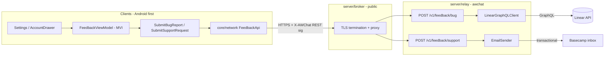

# Plan 001 — Support & bug reporting

| Field                    | Value                                         |
| ------------------------ | --------------------------------------------- |
| **Status**               | Draft                                         |
| **Created**              | 2026-06-07                                    |
| **Updated**              | 2026-06-08                                    |
| **Authoritative design** | [`docs/DESIGN.md`](../docs/DESIGN.md) (rev 4) |
| **Linear target**        | AWChat project on team **Awtools**            |
| **Support inbox**        | `save-b8dA1iGELfV7@app.basecamp.com`          |

---

## Summary

Give users two in-app paths for feedback on every **production client** (Android first; same contract for Phase 2/3 clients):

1. **Report a bug** — structured form → relay → **Linear GraphQL API** → issue on the **AWChat** project (team **Awtools**, label `Bug`).
2. **Contact support** — structured form → relay → email to the Basecamp project inbox above.

Both flows live in the account drawer / settings area. Neither path may expose secrets in the client or leak E2EE message content.

This plan is **cross-cutting**. Platform-specific implementation lives in:

| Surface                                            | Plan                                                                                                          |
| -------------------------------------------------- | ------------------------------------------------------------------------------------------------------------- |
| Relay (Linear + SMTP, rate limits, Postgres audit) | [`plans/server/003-feedback-linear-smtp.md`](./server/003-feedback-linear-smtp.md)                            |
| Android (`feature:feedback`, diagnostics, UI)      | [`plans/android/feedback.md`](./android/feedback.md)                                                          |
| Future clients (GTK, TUI, Apple)                   | [`plans/clients/README.md`](./clients/README.md) — reuse same REST contract and `client_platform` diagnostics |

---

## Goals

| ID  | Goal                                                                                                                          |
| --- | ----------------------------------------------------------------------------------------------------------------------------- |
| G1  | In-app bug report creates a Linear issue without embedding API keys in any client binary                                      |
| G2  | In-app support request delivers to the Basecamp inbox without requiring the user to configure a mail app                      |
| G3  | Diagnostics are privacy-safe (no plaintext messages, contacts, or crypto material) — aligned with design doc telemetry policy |
| G4  | Works on debug and release builds; degrades gracefully when relay is unreachable                                              |
| G5  | Reuses existing relay REST auth (`X-AWChat-*` XEdDSA via `RestAuthSigner`); rate-limited server-side per `user_id`            |
| G6  | Certificate pinning failure screen (PR 23) links to the same support flow — per design doc pinning UX                         |

## Non-goals (v1)

- Screenshot / screen recording upload (v1.1 if needed)
- Two-way Linear comment sync in the app
- In-app chat with support staff
- Automatic crash symbolication upload (PR 24 observability scope)
- Anonymous / unauthenticated feedback in production

---

## Design doc alignment

Merged from [`docs/DESIGN.md`](../docs/DESIGN.md):

| Topic                     | Design policy                                                                                     | Plan 001 application                                                                                                      |
| ------------------------- | ------------------------------------------------------------------------------------------------- | ------------------------------------------------------------------------------------------------------------------------- |
| **Relay auth**            | Mutating REST signed with `X-AWChat-User-Id`, `X-AWChat-Timestamp`, `X-AWChat-Signature` (XEdDSA) | Feedback endpoints use the same middleware as `POST /v1/chats` and `POST /v1/purge`                                       |
| **Telemetry**             | Opt-in crash counts only; no message metadata                                                     | Diagnostics allowlist excludes ciphertext, contacts, safety numbers, DB paths                                             |
| **Pinning failure UX**    | Block with "Can't reach AWChat servers securely" + **support link**; no silent bypass in release  | Pinning error screen deep-links to `SupportScreen` (mailto fallback if relay unreachable)                                 |
| **Account drawer**        | Avatar top-left opens `AccountDrawerSheet` (PR 16)                                                | Primary entry: **Report a bug**, **Contact support** rows                                                                 |
| **Observability (PR 24)** | Relay Prometheus metrics                                                                          | Add `feedback_bug_created_total`, `feedback_support_sent_total`, `feedback_errors_total`                                  |
| **Server role**           | Dumb encrypted relay; no plaintext message bodies                                                 | Feedback is **operational plaintext** (user description + allowlisted diagnostics) — explicitly out of E2EE envelope path |

---

## Roadmap placement

| Milestone            | PR / phase                                              | What it unlocks                                    |
| -------------------- | ------------------------------------------------------- | -------------------------------------------------- |
| **Network**          | PR 11 — `core:network`                                  | `RestAuthSigner`, Ktor client patterns (**done**)  |
| **Server skeleton**  | PR 5 — `server:relay`                                   | Auth middleware, Postgres, health/ready (**done**) |
| **UI home**          | PR 16 — `feature:settings`                              | `AccountDrawerSheet` placement                     |
| **Pinning UX**       | PR 23 — security hardening                              | Pinning failure → support link                     |
| **Metrics**          | PR 24 — observability                                   | Feedback counters on relay                         |
| **Recommended ship** | **Plan PR A** after PR 16 (before or parallel to PR 17) | Drawer exists; beta users can reach support early  |

This plan does **not** modify the ordered 24-PR design doc until promoted. Treat as **Plan PR A** (feedback) until inserted.

---

## Architecture



### Why server-mediated?

| Concern                  | Client-direct                                                 | Relay proxy                   |
| ------------------------ | ------------------------------------------------------------- | ----------------------------- |
| Linear API key in binary | Exposed via reverse engineering                               | Stays in relay env            |
| Support email            | Visible in APK (acceptable) but no send without user mail app | Server sends on user's behalf |
| Rate limiting / abuse    | Hard on device                                                | Centralized per `user_id`     |
| PII scrubbing            | Client can try; server enforces                               | Server is source of truth     |

**Decision:** All outbound integrations go through `server/relay` (via `server/broker` in production). Clients only call existing relay HTTPS endpoints.

---

## Shared API contract

Both endpoints require authenticated REST signing per [`plans/server/current-baseline.md`](./server/current-baseline.md#authentication).

### Diagnostics shape (all clients)

```json
{
  "client_platform": "android|linux-gtk|tui|macos|ios",
  "app_version": "string",
  "build_number": "int",
  "flavor": "debug|release",
  "os_version": "string",
  "device_model": "string",
  "locale": "string"
}
```

Server adds `user_id` (opaque relay id) and `client_time_utc` when creating Linear issues or emails. See [003](./server/003-feedback-linear-smtp.md) for full request/response schemas.

### Linear issue title convention

`[AWChat <Platform>] <user short title>` — e.g. `[AWChat Android]`, `[AWChat Linux GTK]`, `[AWChat TUI]`.

### Rate limits

| Endpoint | Limit           |
| -------- | --------------- |
| Bug      | 5 / user / hour |
| Support  | 3 / user / hour |

Persisted in Postgres `feedback_submissions` (server plan 003).

---

## UI entry points (Android v1; pattern for future clients)

| Location                       | Control                                                               |
| ------------------------------ | --------------------------------------------------------------------- |
| `AccountDrawerSheet` (PR 16)   | Rows: **Report a bug**, **Contact support**                           |
| Pinning failure screen (PR 23) | "Contact support" → same support flow                                 |
| Optional                       | Long-press version label in About → bug report with extra diagnostics |

Future clients mirror the same two flows in their settings/help surface. Details: [`plans/android/feedback.md`](./android/feedback.md).

---

## Secrets & configuration

| Secret / config            | Where                     | Notes                                  |
| -------------------------- | ------------------------- | -------------------------------------- |
| `LINEAR_API_KEY`           | Relay env                 | Create-issues scope, Awtools team only |
| `LINEAR_AWCHAT_PROJECT_ID` | Relay env                 | From Linear project settings           |
| `LINEAR_TEAM_ID`           | Relay env or constant     | `f8ccd0a2-9135-4a5b-85ec-713449a479ae` |
| `LINEAR_BUG_LABEL_ID`      | Relay env or constant     | `4089d123-a465-4cfd-86aa-2a7a72e283d0` |
| `RESEND_API_KEY` (default) | Relay env                 | Support email via Resend               |
| `SUPPORT_EMAIL_TO`         | Relay env                 | Default Basecamp inbox                 |
| Support email in client    | `BuildConfig` or resource | Mailto fallback only                   |

---

## Security & privacy checklist

- [ ] Linear key never in any client binary
- [ ] Bug/support payloads logged server-side at `info` without user message body in production (or redacted)
- [ ] Rate limits enforced per authenticated `user_id`
- [ ] Auth required — anonymous feedback disabled in production
- [ ] Input validation + max lengths on relay
- [ ] Diagnostics allowlist reviewed before GA (no message content, keys, DB paths)
- [ ] Support email address is public-by-design (Basecamp inbox)

---

## Implementation phases

| Phase                 | Owner                                                                 | Scope                                                           |
| --------------------- | --------------------------------------------------------------------- | --------------------------------------------------------------- |
| **0 — Prerequisites** | Ops                                                                   | Create AWChat Linear project; API key; SMTP deliverability test |
| **1 — Server**        | [`003-feedback-linear-smtp.md`](./server/003-feedback-linear-smtp.md) | Endpoints, Linear client, email sender, migration, tests        |
| **2 — Android core**  | [`android/feedback.md`](./android/feedback.md)                        | Domain, network DTOs, repository, `DeviceDiagnostics`           |
| **3 — Android UI**    | [`android/feedback.md`](./android/feedback.md)                        | Screens, drawer wiring, pinning link (after PR 16 / PR 23)      |
| **4 — Hardening**     | Server + PR 24                                                        | Rate tuning, Prometheus metrics, runbooks                       |

---

## Acceptance criteria

1. From the account drawer, user can file a bug report and receive a Linear issue identifier on success.
2. Linear issue appears in **AWChat** project with label **Bug** and diagnostics in description.
3. From the account drawer, user can send a support message that arrives in the Basecamp inbox within 5 minutes (staging verified).
4. Unauthenticated or invalid-signature calls return `401`.
5. Sixth bug report within an hour returns `429`.
6. Release APK strings / decompiled code contain no Linear API key.
7. Submitted diagnostics contain no decrypted message text (automated test per client).
8. Pinning failure screen offers support path without bypassing pinning in release.

---

## Open questions

| #   | Question                                        | Default if unanswered             |
| --- | ----------------------------------------------- | --------------------------------- |
| OQ1 | Insert as formal **PR 16b** vs fold into PR 24? | Ship as **Plan PR A** after PR 16 |
| OQ2 | Require user email on bug reports?              | Optional on both forms            |
| OQ3 | SMTP provider?                                  | Resend for Railway simplicity     |
| OQ4 | Auto-attach relay `user_id`?                    | Yes — opaque id only              |
| OQ5 | Triage state for new Linear issues?             | `Backlog` or team default         |

---

## References

- [`docs/DESIGN.md`](../docs/DESIGN.md) — REST auth, pinning UX, telemetry, PR 16/23/24
- [`plans/server/current-baseline.md`](./server/current-baseline.md) — relay v1 contract
- [`plans/server/003-feedback-linear-smtp.md`](./server/003-feedback-linear-smtp.md) — server implementation
- [`plans/android/feedback.md`](./android/feedback.md) — Android implementation
- [Linear API & Webhooks](https://linear.app/docs/api-and-webhooks)
