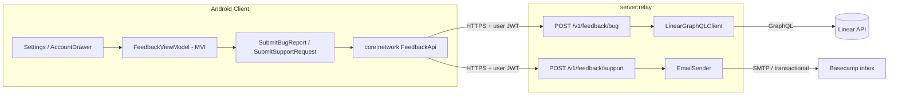

# Plan 001 — Support & bug reporting

| Field             | Value                                                                                |
| ----------------- | ------------------------------------------------------------------------------------ |
| **Status**        | Draft                                                                                |
| **Created**       | 2026-06-07                                                                           |
| **Trigger**       | First post-foundation user-facing feature after the basic Android app shell compiles |
| **Linear target** | AWChat project (to be created) on team **Awtools**                                   |
| **Support inbox** | `save-b8dA1iGELfV7@app.basecamp.com`                                                 |

---

## Summary

Give users two in-app paths for feedback:

1. **Report a bug** — structured form → relay server → **Linear GraphQL API** → issue on the **AWChat** project (team **Awtools**, label `Bug`).
2. **Contact support** — structured form → relay server → email to the Basecamp project inbox above.

Both flows live in the account drawer / settings area. Neither path may expose secrets in the client or leak E2EE message content.

---

## Goals

| ID  | Goal                                                                                                                            |
| --- | ------------------------------------------------------------------------------------------------------------------------------- |
| G1  | In-app bug report creates a Linear issue in the AWChat project without embedding API keys in the APK                            |
| G2  | In-app support request delivers to `save-b8dA1iGELfV7@app.basecamp.com` without requiring the user to configure an email client |
| G3  | Diagnostics attached to bug reports are privacy-safe (no plaintext messages, contacts, or crypto material)                      |
| G4  | Works on debug and release builds; degrades gracefully when relay is unreachable                                                |
| G5  | Reuses existing relay auth where possible; rate-limited server-side                                                             |

## Non-goals (v1)

- Screenshot / screen recording upload (add in v1.1 if needed)
- Two-way Linear comment sync in the app
- In-app chat with support staff
- Automatic crash symbolication upload (separate observability work in PR 24)

---

## Roadmap placement

| Milestone            | PR / phase                                            | What it unlocks                                                 |
| -------------------- | ----------------------------------------------------- | --------------------------------------------------------------- |
| **Minimum**          | PR 2 — Android Compose shell + CI                     | `feature:feedback` module can compile; stub screens             |
| **UI home**          | PR 16 — `feature:settings` account drawer             | Natural placement for "Report a bug" and "Contact support" rows |
| **Network**          | PR 11 — `core:network`                                | Ktor client, auth handshake patterns to copy                    |
| **Server**           | PR 5 — `server:relay` skeleton                        | Extend relay with feedback endpoints                            |
| **Recommended ship** | New plan PR after PR 16 (before or parallel to PR 17) | Drawer exists; users can reach support early in beta            |

This plan does **not** modify the ordered 24-PR design doc until we decide to insert a numbered PR. Treat it as **Plan PR A** (feedback) until promoted.

---

## Architecture



### Why server-mediated?

| Concern               | Client-direct                                                 | Relay proxy                   |
| --------------------- | ------------------------------------------------------------- | ----------------------------- |
| Linear API key in APK | Exposed via reverse engineering                               | Stays in server env           |
| Support email address | Visible in APK (acceptable) but no send without user mail app | Server sends on user's behalf |
| Rate limiting / abuse | Hard on device                                                | Centralized per `user_id`     |
| PII scrubbing         | Client can try; server enforces                               | Server is source of truth     |

**Decision:** All outbound integrations go through `server:relay`. The Android app only talks to existing relay HTTPS endpoints.

---

## Linear integration (bug reports)

### Workspace facts (as of 2026-06-07)

| Item                       | Value                                                      |
| -------------------------- | ---------------------------------------------------------- |
| Team                       | **Awtools** (`f8ccd0a2-9135-4a5b-85ec-713449a479ae`)       |
| Project                    | **AWChat** — not created yet; create before implementation |
| Existing labels on Awtools | `Bug`, `Feature`, `Improvement`                            |

### One-time setup

1. In Linear: **Projects → New project → AWChat** (link to Awtools team).
2. **Settings → Account → Security & Access → Personal API keys**: create key with **Create issues** (+ Read) scope, limited to **Awtools** team.
3. Store key as relay secret `LINEAR_API_KEY` (never in repo).
4. Record project ID in relay config `LINEAR_AWCHAT_PROJECT_ID` after creation.

### GraphQL mutation (server)

```graphql
mutation CreateBugIssue($input: IssueCreateInput!) {
  issueCreate(input: $input) {
    success
    issue {
      id
      identifier
      url
    }
  }
}
```

Example variables:

```json
{
  "input": {
    "teamId": "f8ccd0a2-9135-4a5b-85ec-713449a479ae",
    "projectId": "<LINEAR_AWCHAT_PROJECT_ID>",
    "title": "[AWChat Android] Crash on opening chat",
    "description": "## User description\n...\n\n## Diagnostics\n- app_version: 0.1.0 (42)\n- os: Android 15 / API 35\n- device: Pixel 8\n- build_flavor: debug\n- user_id: <opaque server id, not phone number>",
    "labelIds": ["4089d123-a465-4cfd-86aa-2a7a72e283d0"],
    "priority": 3
  }
}
```

Endpoint: `POST https://api.linear.app/graphql` with header `Authorization: <LINEAR_API_KEY>`.

### Issue title convention

`[AWChat Android] <user short title>` — keeps inbox filtering obvious.

### Description template (Markdown)

```markdown
## Report

<user free text>

## Diagnostics

| Field           | Value           |
| --------------- | --------------- |
| app_version     | …               |
| build_number    | …               |
| flavor          | debug / release |
| os_version      | …               |
| device_model    | …               |
| locale          | …               |
| user_id         | relay opaque id |
| client_time_utc | ISO-8601        |

## Optional

- steps_to_reproduce (if provided)
- expected_vs_actual (if provided)
```

No message bodies, safety numbers, prekeys, or SQLCipher paths.

---

## Support email integration

### Destination

`save-b8dA1iGELfV7@app.basecamp.com` — Basecamp project email; posts become Basecamp cards/comments.

### Server send path (preferred)

Relay exposes `POST /v1/feedback/support`. On success, relay sends email via transactional SMTP (e.g. Resend, Postmark, or Railway-compatible provider):

| Header     | Value                                                          |
| ---------- | -------------------------------------------------------------- |
| `To`       | `save-b8dA1iGELfV7@app.basecamp.com`                           |
| `From`     | `AWChat Support <noreply@awfixer.me>` (or dedicated subdomain) |
| `Reply-To` | User-supplied email if provided, else omit                     |
| `Subject`  | `[AWChat Support] <category> — <first 60 chars of message>`    |

Body mirrors bug-report diagnostics table plus user message.

### Fallback (if SMTP not ready)

Android `Intent.ACTION_SENDTO` with `mailto:save-b8dA1iGELfV7@app.basecamp.com` and prefilled subject/body. Show only when server returns `503` or user opts into "Open in email app". Document as degraded UX for v1 beta.

---

## Relay API

Both endpoints require the same authenticated session as other relay REST calls (PR 5 auth middleware).

### `POST /v1/feedback/bug`

**Request**

```json
{
  "title": "string, 5–120 chars",
  "description": "string, 10–4000 chars",
  "steps_to_reproduce": "optional string",
  "expected_behavior": "optional string",
  "actual_behavior": "optional string",
  "diagnostics": {
    "app_version": "string",
    "build_number": "int",
    "flavor": "debug|release",
    "os_version": "string",
    "device_model": "string",
    "locale": "string"
  }
}
```

**Response `201`**

```json
{
  "issue_identifier": "AWT-123",
  "issue_url": "https://linear.app/awtools/issue/AWT-123/..."
}
```

**Errors:** `400` validation, `401` auth, `429` rate limit, `502` Linear failure (opaque message to client).

### `POST /v1/feedback/support`

**Request**

```json
{
  "category": "account|billing|privacy|other",
  "message": "string, 10–4000 chars",
  "contact_email": "optional email for Reply-To",
  "diagnostics": { "... same shape as bug ..." }
}
```

**Response `202`**

```json
{
  "ticket_id": "uuid",
  "status": "queued"
}
```

### Rate limits

| Endpoint | Limit           |
| -------- | --------------- |
| Bug      | 5 / user / hour |
| Support  | 3 / user / hour |

Persist counters in Postgres (`feedback_submissions`) for audit and abuse review.

---

## Android modules & UI

### New module

`feature/feedback/` — MVI, depends on `core:domain`, `core:network`, `core:designsystem`.

### Domain

```kotlin
interface FeedbackRepository {
    suspend fun submitBugReport(report: BugReport): Result<LinearIssueRef>
    suspend fun submitSupportRequest(request: SupportRequest): Result<SupportSubmissionRef>
}
```

Use cases: `SubmitBugReportUseCase`, `SubmitSupportRequestUseCase`.

### UI entry points

| Location                            | Control                                                                      |
| ----------------------------------- | ---------------------------------------------------------------------------- |
| `AccountDrawerSheet` (PR 16)        | Rows: **Report a bug**, **Contact support**                                  |
| Pinning failure screen (design doc) | "Contact support" link → same support flow                                   |
| Optional                            | Long-press version label in About → hidden bug report with extra diagnostics |

### Screens

1. **BugReportScreen** — title, description, optional repro fields, submit, success shows Linear issue id + copy link.
2. **SupportScreen** — category chips, message, optional email, submit, success confirmation.

Material 3 Expressive: use same motion/shape as drawer; inline error states; no WebView.

### Diagnostics collector

`core:common` → `DeviceDiagnostics` gathers only allowlisted fields at submit time. Unit-test that forbidden keys (message content, keys, DB paths) are never serialized.

---

## Secrets & configuration

| Secret / config              | Where                             | Notes                                        |
| ---------------------------- | --------------------------------- | -------------------------------------------- |
| `LINEAR_API_KEY`             | Relay env (Railway / Fly secrets) | Create issues scope, Awtools team only       |
| `LINEAR_AWCHAT_PROJECT_ID`   | Relay env                         | From Linear project settings                 |
| `LINEAR_TEAM_ID`             | Relay env or constant             | `f8ccd0a2-9135-4a5b-85ec-713449a479ae`       |
| `LINEAR_BUG_LABEL_ID`        | Relay env or constant             | `4089d123-a465-4cfd-86aa-2a7a72e283d0`       |
| `SMTP_*` or `RESEND_API_KEY` | Relay env                         | For support email                            |
| `SUPPORT_EMAIL_TO`           | Relay env                         | Default `save-b8dA1iGELfV7@app.basecamp.com` |
| Support email in client      | `BuildConfig` or resource         | Only needed for mailto fallback              |

CI: mock Linear and SMTP in relay unit tests; Android uses fake `FeedbackRepository` in screenshot tests.

---

## Security & privacy checklist

- [ ] Linear key never in client, ProGuard/R8 rules irrelevant for this secret
- [ ] Bug/support payloads logged server-side at `info` without user message body in production logs (or redacted)
- [ ] Rate limits enforced
- [ ] Auth required — anonymous feedback disabled in production
- [ ] Input validation + max lengths on relay
- [ ] Diagnostics allowlist reviewed by security pass before release
- [ ] Support email address is public-by-design (Basecamp inbox); no additional secret

---

## Implementation phases

### Phase 0 — Prerequisites (before coding)

- [ ] Create **AWChat** project in Linear under **Awtools**
- [ ] Issue Linear API key; configure relay secrets in staging
- [ ] Choose SMTP provider and verify deliverability to Basecamp inbox (send test email)

### Phase 1 — Relay backend

- [ ] `LinearGraphQLClient` in `server:relay`
- [ ] `EmailSender` abstraction + provider impl
- [ ] `POST /v1/feedback/bug` and `POST /v1/feedback/support`
- [ ] Postgres migration `feedback_submissions`
- [ ] Unit tests with HTTP mocks

### Phase 2 — Android core

- [ ] `core:domain` interfaces + models
- [ ] `core:network` DTOs + `FeedbackApi`
- [ ] `FeedbackRepositoryImpl` wired via Hilt
- [ ] `DeviceDiagnostics` collector

### Phase 3 — UI (after PR 16)

- [ ] `feature:feedback` screens + ViewModels
- [ ] Wire into `AccountDrawerSheet`
- [ ] Pinning failure support link
- [ ] Emulator + unit tests

### Phase 4 — Hardening

- [ ] Rate limit tuning from staging traffic
- [ ] Relay metrics: `feedback_bug_created_total`, `feedback_support_sent_total`, `feedback_errors_total`
- [ ] Runbook: rotate Linear key, SMTP bounce handling

---

## Acceptance criteria

1. From the account drawer, user can file a bug report and receive a Linear issue identifier on success.
2. Linear issue appears in **AWChat** project with label **Bug** and diagnostics in description.
3. From the account drawer, user can send a support message that arrives in the Basecamp inbox within 5 minutes (staging verified).
4. Unauthenticated calls return `401`.
5. Sixth bug report within an hour returns `429`.
6. Release APK strings / decompiled code contain no Linear API key.
7. Submitted diagnostics contain no decrypted message text (automated test).

---

## Open questions

| #   | Question                                               | Default if unanswered             |
| --- | ------------------------------------------------------ | --------------------------------- |
| OQ1 | Insert as formal **PR 16b** vs fold into PR 24 polish? | Ship as **Plan PR A** after PR 16 |
| OQ2 | Require user email on bug reports?                     | Optional on both forms            |
| OQ3 | SMTP provider (Resend vs Postmark vs self-host)?       | Resend for Railway simplicity     |
| OQ4 | Should bug reports auto-attach relay `user_id`?        | Yes — opaque id only              |
| OQ5 | Triage state for new Linear issues?                    | `Backlog` or team default         |

---

## References

- [Linear API & Webhooks](https://linear.app/docs/api-and-webhooks)
- [Creating issues (incl. GraphQL)](https://linear.app/docs/creating-issues)
- Design doc pinning failure UX: support link in `docs/DESIGN.md`
- Team **Awtools** in Linear workspace
