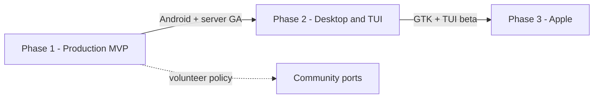

# AWChat — Client portfolio

| Field                    | Value                                            |
| ------------------------ | ------------------------------------------------ |
| **Status**               | Planning                                         |
| **Created**              | 2026-06-08                                       |
| **Authoritative design** | [`docs/DESIGN.md`](../../docs/DESIGN.md) (rev 4) |

---

## Summary

AWChat ships **one production client** first (Android) and **one backend** (`server/relay` + broker + auth). Additional clients reuse the same relay v1 contract (REST + WebSocket, XEdDSA auth, E2EE on device) once Android and server meet production standards.

This folder plans **future surfaces** without modifying the 24-PR Android roadmap until each client is promoted.

---

## Phase gates



| Phase         | Clients                                                | Gate                                                                                                    |
| ------------- | ------------------------------------------------------ | ------------------------------------------------------------------------------------------------------- |
| **1**         | **Android** (primary)                                  | PR 24 complete; relay contract frozen at `/v1`                                                          |
| **2**         | **Linux GTK desktop**, **Ratatui TUI** (macOS + Linux) | Phase 1 GA; shared `core` crypto/network patterns ported or reimplemented in Rust                       |
| **3**         | **macOS desktop**, **iOS mobile**                      | Phase 1 GA; Apple developer hardware available                                                          |
| **Community** | e.g. Windows                                           | [Community client ports](../../docs/DESIGN.md#community-client-ports-eg-windows) — volunteer code owner |

**Explicit non-goals (design doc):** Official Windows client (NG4b). iOS in v1 MVP (NG4) — Phase 3 only.

---

## Shared contract (all clients)

Every client must implement:

| Layer     | Contract                                                                           |
| --------- | ---------------------------------------------------------------------------------- |
| Identity  | libsignal X3DH + Double Ratchet (1:1); Sender Keys (groups ≤5)                     |
| Transport | `POST /v1/register`, prekeys, chats, purge; `WS /v1/ws` frames                     |
| Auth      | REST `X-AWChat-*` signing; WS `auth_challenge` / `auth_response`                   |
| Retention | Client-computed seen-by-all → signed purge; local SQLCipher-equivalent store       |
| Feedback  | [Plan 001](../001-support-and-bug-reporting.md) — `client_platform` in diagnostics |
| Pinning   | SPKI pins for relay; failure UX → support (no silent bypass in release)            |

Server baseline: [`plans/server/current-baseline.md`](../server/current-baseline.md).

---

## Planned repo layout (when promoted)

```
clients/
  android/          # → today: repo root app/ + core/* (Phase 1)
  linux-gtk/        # Phase 2 — GTK 4 + libadwaita
  tui/              # Phase 2 — Ratatui, macOS + Linux
  apple/            # Phase 3 — macOS + iOS (Swift/SwiftUI or Rust FFI — TBD)
  windows/          # Community only — if accepted per policy
```

Until Phase 2 begins, Android remains at repo root per the 24-PR plan. New client subtrees are created when each phase starts — not empty placeholders.

---

## Client index

| Client        | Path (future)        | Stack                                     | Platforms    | Plan                                                                  |
| ------------- | -------------------- | ----------------------------------------- | ------------ | --------------------------------------------------------------------- |
| Android       | `app/`, `core/*`     | Kotlin, Compose, M3 Expressive            | Android      | [`plans/android/current-baseline.md`](../android/current-baseline.md) |
| Linux desktop | `clients/linux-gtk/` | Rust or C++ + GTK 4 / libadwaita          | Linux        | [desktop-linux-gtk.md](./desktop-linux-gtk.md)                        |
| TUI           | `clients/tui/`       | Rust + Ratatui                            | macOS, Linux | [tui-ratatui.md](./tui-ratatui.md)                                    |
| Apple         | `clients/apple/`     | TBD (SwiftUI + Rust libsignal FFI likely) | macOS, iOS   | [apple-macos-ios.md](./apple-macos-ios.md)                            |

---

## Cross-client features

| Feature             | Android (Phase 1)     | Phase 2+ clients                          |
| ------------------- | --------------------- | ----------------------------------------- |
| E2EE messaging      | PRs 18–22             | Port SessionManager equivalent            |
| App lock / duress   | PR 14                 | Platform Keychain / kernel keyring        |
| Feedback            | Plan 001 / PR A       | Same REST endpoints, platform diagnostics |
| Background delivery | NG8 — foreground only | Same until FCM/APNs in v1.1               |

---

## References

- [`docs/DESIGN.md`](../../docs/DESIGN.md) — NG4, NG4b, community ports
- [`plans/README.md`](../README.md) — master plan index
- [`plans/001-support-and-bug-reporting.md`](../001-support-and-bug-reporting.md) — multi-platform feedback
