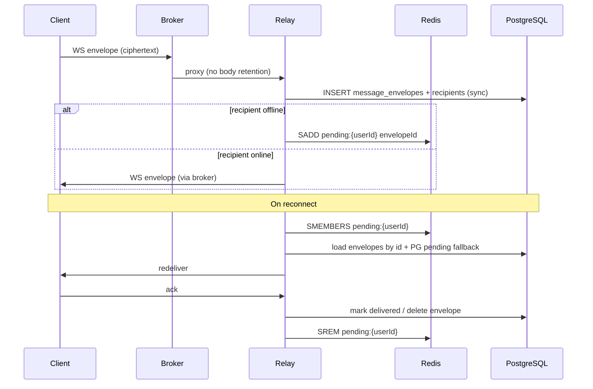

# Server — Redis, durable encrypted pipeline, serverless ops

| Field                    | Value                                                                                                                                       |
| ------------------------ | ------------------------------------------------------------------------------------------------------------------------------------------- |
| **Status**               | Draft (in progress)                                                                                                                         |
| **Created**              | 2026-06-08                                                                                                                                  |
| **Depends on**           | [`current-baseline.md`](./current-baseline.md); Railway monorepo (`broker`, `auth`, `awchat`)                                               |
| **Authoritative design** | [`docs/DESIGN.md`](../../docs/DESIGN.md) (rev 4); this plan **supersedes** the “no Redis in v1” deployment note for **hosted** environments |

---

## Goals

1. **Aggressive durability for ciphertext** — every accepted envelope is written to **PostgreSQL immediately** (source of truth). Optionally offload large `ciphertext` blobs to an **object bucket** (Railway volume / S3-compatible) in a follow-up; metadata and routing stay in Postgres.
2. **Redis in the stack** — Railway **Redis** plugin gives the **broker** and **relay** shared ephemeral state so serverless/teardown cycles do not rely on process memory alone.
3. **Broker working space** — Redis-backed rate limits and ops-visible queue depth; broker remains a stateless reverse proxy for message bodies (no ciphertext held at the edge).
4. **Serverless + teardown (interim)** — **All** services (`broker`, `auth`, `awchat`, Postgres, Redis) may run with **serverless** and **teardown** enabled during bring-up to control cost. **Disable serverless/teardown on `broker` only** when the public API is production-ready; keep internal services serverless longer if desired.
5. **Server code** — Relay uses Redis **between** the public edge path (broker → relay) and durable stores: hot pending-envelope index per recipient, drained on WS connect before Postgres backfill.

Non-goals: decrypting message bodies; changing the v1 WS/REST frame contract; multi-node HA (Redis here is durability + broker headroom, not full fan-out yet).

---

## Railway topology

| Service          | Role                            | Serverless / teardown (bring-up) | Production note                                   |
| ---------------- | ------------------------------- | -------------------------------- | ------------------------------------------------- |
| `broker`         | Public edge                     | Enabled during dev               | **Disable** when done — always-on public entry    |
| `auth`           | Internal REST                   | Enabled                          | May stay serverless                               |
| `awchat` (relay) | Internal REST + WS              | Enabled                          | Cold starts OK if Redis + Postgres hold queue     |
| Postgres (relay) | Envelope + chat metadata        | Plugin default                   | Durable                                           |
| Postgres-Auth    | Identities / invites            | Plugin default                   | Durable                                           |
| **Redis**        | Hot queues + broker rate limits | Plugin                           | Durable plugin; not torn down with app containers |

**Plugins to add:** `Redis` (shared). Reference in services via `${{Redis.REDIS_URL}}` (exact reference name per Railway dashboard).

**Object bucket (phase 2):** Railway bucket or external S3-compatible storage for `ciphertext` bytes; Postgres holds `ciphertext_ref` + SHA-256. Phase 1 keeps `BYTEA` in `message_envelopes` with **synchronous** insert before any fan-out.

---

## Data flow (encrypted envelopes)

**Rules**

| Rule             | Detail                                                                                                    |
| ---------------- | --------------------------------------------------------------------------------------------------------- |
| Dual write       | Postgres **always**; Redis **only** for recipients not connected at accept time                           |
| Source of truth  | Postgres; Redis is an accelerator — loss of Redis must not lose ciphertext (replay from PG pending query) |
| TTL              | Redis keys expire with envelope `purge_after` (aligned to 48h ceiling)                                    |
| Bucket (phase 2) | After PG row, async or sync PUT ciphertext; row stores `storage = 'pg' \| 'bucket'`                       |

---

## Component changes

### Relay (`server/relay`)

| Piece                      | Change                                                                                                                |
| -------------------------- | --------------------------------------------------------------------------------------------------------------------- |
| `redix`                    | Connection pool; `REDIS_URL` required in prod when Redis plugin attached                                              |
| `Gateway.EnvelopeHotQueue` | `SADD` / `SMEMBERS` / `SREM` per recipient; key prefix `awchat:v1:pending:`                                           |
| `Gateway.Delivery`         | After successful PG transaction, push envelope id to Redis for offline members; `redeliver_pending` merges Redis + PG |
| `GET /v1/ready`            | Extend readiness: Postgres **and** Redis `PING` when `REDIS_URL` set                                                  |
| Rate limits                | Unchanged at relay (broker handles edge limits)                                                                       |

### Broker (`server/broker`)

| Piece                  | Change                                                                                          |
| ---------------------- | ----------------------------------------------------------------------------------------------- |
| `hammer_backend_redis` | When `REDIS_URL` set, rate limits use **Redis** (shared across broker replicas / cold restarts) |
| Fallback               | No `REDIS_URL` → existing ETS Hammer (local dev)                                                |
| Ops                    | `/ops/status` may include Redis reachability (optional follow-up)                               |

### Auth (`server/auth`)

| Piece          | Change                                          |
| -------------- | ----------------------------------------------- |
| v1             | No Redis required (Postgres-only identities)    |
| Optional later | Short-lived challenge cache if auth WS is added |

---

## Environment variables

| Variable                           | Service            | Required         | Purpose      |
| ---------------------------------- | ------------------ | ---------------- | ------------ |
| `REDIS_URL`                        | `broker`, `awchat` | Prod with plugin | Shared Redis |
| `DATABASE_URL`                     | `awchat`, `auth`   | Yes              | Unchanged    |
| `RELAY_UPSTREAM` / `AUTH_UPSTREAM` | `broker`           | Yes              | Unchanged    |

Do **not** commit `REDIS_URL` or bucket credentials.

---

## Acceptance criteria

| ID   | Criterion                                                                                                            |
| ---- | -------------------------------------------------------------------------------------------------------------------- |
| AC-1 | Envelope accepted over WS is visible in Postgres before `200`/push completes to sender                               |
| AC-2 | Offline recipient has envelope id in Redis **and** PG recipient row                                                  |
| AC-3 | On WS auth_ok, client receives pending envelopes from Redis ∪ PG without duplicate delivery (client dedupes by id)   |
| AC-4 | `ack` clears PG delivery state and Redis pending id                                                                  |
| AC-5 | With `REDIS_URL`, broker rate limits survive broker process restart (smoke: two hits, restart, limit still enforced) |
| AC-6 | `GET /v1/ready` returns 503 if Redis configured but unreachable                                                      |
| AC-7 | Plan + `RAILWAY.md` document serverless/teardown policy and Redis plugin                                             |
| AC-8 | Local `docker compose` can run optional `redis` service for integration dev                                          |

---

## Implementation phases

| Phase            | Scope                                                                           |
| ---------------- | ------------------------------------------------------------------------------- |
| **2a** (this PR) | Plan, relay Redis hot queue, broker Redis rate limits, compose + bootstrap docs |
| **2b**           | Object bucket for `ciphertext`, `ciphertext_ref` migration                      |
| **2c**           | Broker ops Redis probe; attachment path per DESIGN v1.1                         |

---

## References

- [`plans/server/current-baseline.md`](./current-baseline.md)
- [`RAILWAY.md`](../../RAILWAY.md)
- [`docs/DESIGN.md`](../../docs/DESIGN.md) — Redis rejection note applies to **original** single-node MVP only; hosted stack explicitly adds Redis per this plan
